# AD Summary

Die Graphen unter dem Kapitel Graphtheorie wurden mittels Mermaid erstellt. Daher sieht man diese im .pdf nicht. Dieses Kapitel nochmals mit den Mermaid Graphen also hier:

# SW14 - Graphalgorithmen

# Grundlagen

Ein Graph beschreibt die Beziehung zwischen Objekten. Die Objekte heissen Knoten, die Beziehungen werden mithilfe von Kanten dargestellt.3

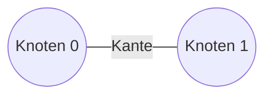

Zum Beispiel kann man ein Transportnetz als Graph darstellen. Die Knoten hierbei wären die Städte, und die Kanten die Verbindungen zwischen den Städten.

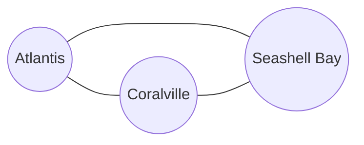

## Gerichtete und ungerichtete Graphen

**Gerichtete Graphen**

**Ungerichtete Graphen**

Bei einem gerichteten Graphen kann man an einer Kante nur in eine Richtung gehen

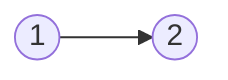

Bei gerichteten Graphen heissen 2 Knoten **stark verbunden**, wenn eine Verbindung in beide Richtungen zwischen den Knoten existiert:

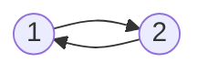

Bei einem ungerichteten Graphen kann man an einer Kante in beide Richtungen gehen

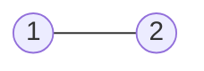

Ein ungerichteter Graph kann immer als gerichteter Graph dargestellt werden, da man eine Kante mit 2 Pfeilen ersetzen kann.

# Grad

Jeder Knoten in einem Graphen hat einen Grad. Dieser Grad bestimmt wie viele Kanten von dem Knoten ausgehen.

Für gerichtete Graphen:

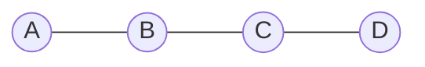

| Knoten | Grad |
| ------ | ---- |
| A      | 1    |
| B      | 2    |
| C      | 2    |
| D      | 1    |

Für ungerichtete Graphen:

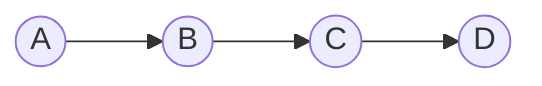

| Knoten | Eingangsgrad | Ausgangsgrad |
| ------ | ------------ | ------------ |
| A      | 0            | 1            |
| B      | 1            | 1            |
| C      | 1            | 1            |
| D      | 1            | 0            |

# Markierte Graphen

In markierten Graphen tragen die Kanten zusätzliche Informationen.

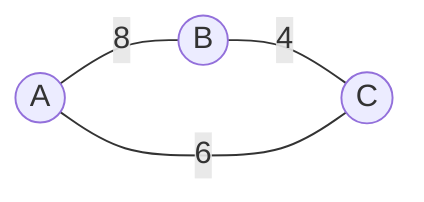

Ein Beispiel bei einem Transportnetz wäre hierbei die Reisedauer zwischen den Städten.

# Formale Beschreibung

## Graph

- Als 2-Tupel: G = (V, E)
- Knotenmenge V (Knoten = Vertex)
  V = {a, b, c, d, e}, |V| = 5
- Kantenmenge E (Kante = Edge), E ⊆ V × V
  E = {(a,b), (b,a), (b,c), (a,c), (c,c), (c,d), (a,d)}, |E| = 7

Darstellung von G:

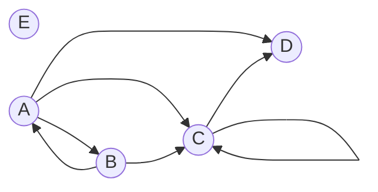

## Teilgraph

- Als 2-Tupel: G’ = (V’, E’)
- Knotenmenge V’ ⊆ V
  V’ = {a, b, c}
  V’ ⊆ V = {a,b,c,d,e}
- Kantenmenge E’ ⊆ E und E’ ⊆ V’ × V’
  E’ = {(a, b), (b, c), (a, c)}
  E’ ⊆ E = {(a, b), (b, a), (b, c), (a, c), (c, c), (c, d), (a, d)}

Darstellung von G’:

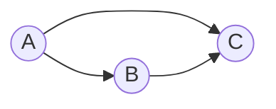

# Dicht vs Dünn besetzter Graph

**Dicht**

**Dünn**

$|E| \approx |V|^2$

$|E| = 19 \text{ und } |V| = 5 \\
19 \approx 25$

$|E| << |V|^2$

$|E| = 7 \text{ und } |V| = 5 \\
7 << 25$

Eine andere Möglichkeit dies einzuschätzen ist es die tatsächlichen Kanten durch die möglichen Kanten zu Teilen.

$Q = \frac{Tatsächliche Kanten }{Mögliche Kanten}$

Wenn dies $\ge 0.5$ ist spricht man von einem dichten Graphen, da mindestens 50% der möglichen Kanten tatsächlich existieren.

<aside>
⚠️ Letztere Methode ist nicht offizieller Inhalt des Moduls Algorithmen und Datenstrukturen

</aside>

# Pfade und Zyklen

Falls ein Graph eine Verbindung (Kante) zwischen A → B → C → D hat, existiert ein Pfad/Weg von A nach D. Dieser hat dann die Länge 3.

Ein Pfad von Knoten x nach Knoten x heisst Zyklus.

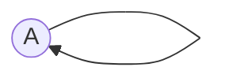

Gerichtete Graphen

- sind zyklenfrei oder azyklisch, wenn sie keine Zyklen enthalten.

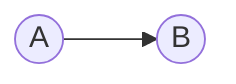

Gerichteter Zyklenfreier Graph

Ungerichtete Graphen

- sind zyklenfrei oder azyklsich, wenn es zwischen zwei beliebigen Knoten höchstens einen Pfad gibt (ohne triviale Zyklen)
- Triviale Zyklen: (a,b,a), (a,a)

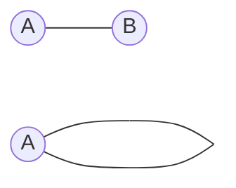

Bei n Knoten und mindestens n Kanten, gibt es einen Zyklus

Ungerichteter Zyklenfreier Graph

Ungerichteter Graph mit mind. Zyklus

# Bewertete Graphen

Formale Beschreibung:

- Als 3-Tupel: G = (V, E, (f(E) )
- Die Gewichtsfunktion f(E), ordnet jeder Kante ein Gewicht (einen Wert) zu.
- Es resultieren bei einem bewerteten Graphen 2 Dinge:
  - Eine **Länge**: Anzahl Kanten zwischen zwei Knoten
  - Eine **bewertete Länge**: Summe der Bewertungen zwischen zwei Knotenm auch als Entfernung gekennzeichnet

Ein Beispiel für den Pfad: (a, b, c, d)

Länge: 3

Bewertete Länge: 16

# Baum

Ein ungerichteter, zusammenhängender und zyklenfreier Graph ist ein Baum.

- ungerichtet: Kanten sind symmetrisch.
- zusammenhängend: Graph zerfällt nicht in Komponenten.
- zyklenfrei: Zwischen je zwei Knoten gibt es genau einen Pfad.

Ein Baum mit n Knoten hat n-1 Kanten

Ein Teilgraph eines ungerichteten, zusammenhängenden Graphen ist ein aufspannender Baum → Spanning Tree

Folgende Graphen-Algorithmen liefern mitunter einen Spanning-Tree für einen ungerichteten Graphen:

- Breitensuche
- Tiefensuche
- Algorithmus von Dijkstra

# Problemlösung mittels Graphen

Typische Vorgehensweise:

1. Problem als Graphen modellieren.
2. Zielfunktion als Eigenschaft des Graphen formulieren.
3. Mit Hilfe eines Graphen-Algorithmus das Problem lösen.

## Grundtypen der Zielfindung / Zielfunktion

Pfad, d.h. Kanten finden:

- Kürzesten Weg finden
- Rundweg via alle Knoten finden (kürzester Rundweg → Travelling Salesman Problem, TSP)
- Jede Kante besuchen (Chinese Postman Problem)
- Alle Knoten aufspannen (Spanning-Tree)

Kanten Werte zuordnen:

- Max. Flow, d.h. max. «Durchfluss» bei gegebenen Kapazitäten finden.
- Min. Cost Flow, d.h. «Angebot (+), Nachfrage (-)» befriedigen bei min. Kosten.

Knoten Werte zuordnen:

- Coloring, d.h. alle verbundenen Kontenpaare besitzen unterschiedliche Farben.
- Scheduling, d.h. mögliche Abfolge finden, trotz Abhängigkeiten/Restriktionen.

# Adjazenzmatrix

- Speicherkomplexität → O(|V|2)

Gerichtet, unbewertet

Für gerichtete, unbewertete Graphen zeigt die Matrix ob eine Verbindung von Knoten x zu Knoten y existiert (True, False).

| -   | a   | b   | c   | d   | e   |
| --- | --- | --- | --- | --- | --- |
| a   | 0   | 1   | 1   | 1   | 0   |
| b   | 1   | 0   | 1   | 0   | 0   |
| c   | 0   | 0   | 1   | 1   | 0   |
| d   | 0   | 0   | 0   | 0   | 0   |
| e   | 0   | 0   | 0   | 0   | 0   |

gerichtet, bewertet

Für gerichtete, bewertete Graphen zeigt die Matrix die Bewertung von Knoten x zu y.

| -   | a   | b   | c   | d   | e   |
| --- | --- | --- | --- | --- | --- |
| a   | ∞   | 10  | 7   | 4   | ∞   |
| b   | 5   | ∞   | 4   | ∞   | ∞   |
| c   | ∞   | ∞   | 10  | 2   | ∞   |
| d   | ∞   | ∞   | ∞   | ∞   | ∞   |
| e   | ∞   | ∞   | ∞   | ∞   | ∞   |

ungerichtet, unbewertet

Für ungerichtete, unbewertete Graphen zeigt die Matrix ob eine Verbindung existiert. Hierbei sehen wir auch, dass sich die Matrix in der Diagonale spiegelt.

| -   | a   | b   | c   | d   | e   |
| --- | --- | --- | --- | --- | --- |
| a   | 0   | 1   | 1   | 1   | 0   |
| b   | 1   | 0   | 1   | 0   | 0   |
| c   | 1   | 1   | 0   | 1   | 0   |
| d   | 1   | 0   | 1   | 0   | 0   |
| e   | 0   | 0   | 0   | 0   | 0   |

# Adjazentlisten

- Speicherkomplexität → O(|V|+|E|)

Es gibt unterschiedliche Möglichkeiten Adjazenzlisten umzusetzen. Hier sind drei davon:

# Traversieren

- Bei vielen Graphalgorithmen geht man durch alle Knoten über alle Kanten durch.
- Um bei Graphen mit Zyklen nicht in Schleifen zu kommen muss man diese markieren
- Man unterscheidet zwischen folgenden Strategien
  - Breitensuche
  - Tiefensuche

## Breitensuche (Breadth First Search, BFS)

Die Breitensuche ist vorallem dann gut, wenn man den Shortest Path in einem unmarkierten Graphen finden möchte.

Bei der Breitensuche werden zuerst die angrenzenden Knoten angeschaut, bevor in einer tieferen Ebene gesucht wird.

Die Zeitkomplexität beträgt → **O(|V|+|E|)**

Funktioniert nach dem **FIFO** Prinzip. First in - First out. → Wie eine **Queue**.

[Breadth First Search Algorithm | Shortest Path | Graph Theory](https://www.youtube.com/watch?v=oDqjPvD54Ss)

So geht man zuerst zur Start-Node und sucht deren direkt anhängenden Nodes ab. Danach geht man von einer dieser Nodes zu deren direkt anhängenden Nodes und macht dort das selbe.

Rechts auf den Bildern sieht man die jeweils gerade anhängenden Nodes. In dieser Reihenfolge werden weitere Nodes abgesucht.

Wenn wir auf eine Zahl treffen, auf der wir keine neuen Nodes entdecken. Gehen wir einfach weiter zur nächsten in der **Queue**.

## Tiefensuche (Depth First Search, DFS)

Die Zeitkomplexität beträgt → **O(|V|+|E|)**.

Funktioniert nach dem **LIFO** Prinzip. Last in - First out. → Wie ein **Stack**.

[Depth First Search Algorithm | Graph Theory](https://www.youtube.com/watch?v=7fujbpJ0LB4)

Bei der Tiefensuche geht man von einem Knoten direkt zum nächsten. Dabei ist es egal welchen Knoten man zuerst durchsucht. Dies macht man bis man irgendwann nicht weiterkommt.

Nehmen wir das Beispiel auf Bild 4 auf dem Knoten mit der Nummer 7. Wir kommen nachdem wir von 7 → 10 → 11 gehen wir zurück auf die 7. Da wir die hier aber nun auch wo anders weiterkommen, können wir direkt von hier fortfahren.

Nachdem wir von 7 → 3 → 2 gekommen sind, stellen wir fest, dass wir hier nicht mehr weiterkommen. Wenn wir also gar nicht mehr weiterkommen, können wir zurück zum letzten Knoten. Von hier aus versuchen wir nun wieder weiterzukommen.

Nehmen wir an, wir haben nun alle Knoten durchsucht und landen wieder bei der 7. Von der 7 an, haben wir jedoch ebenfalls keine neuen Knoten. Was nun passiert ist, dass wir Schritt für Schritt zurück gehen und bei jedem Knoten, ob wir neue Knoten wählen können.

So kommen wir zurück über die 8 zum Knoten mit der 1 und so auch wieder ans Ende. Wenn wir am Ende (Start-Knoten) angekommen sind, sind wir fertig.

# Transitive Hülle

Transitive Hüllen erhält man, wenn zwei Kanten (a,b) und (b,c) indirekt also auch a → c ergeben.

> Mit einer Kante (x, y) und einer Kante (y, z) folgt auch (x, z), d.h. der Knoten z ist vom Knoten x aus erreichbar
>
> 

# Algorithms

## Algorithmus von Floyd

Mit dem Floyd Warshall Algorithm versucht man alle kürzesten Wege zwischen allen Knoten zu finden. → Generierte table am Schluss für mich nicht schlüssig, was die Werte darstellen sollen.

<aside>
😒 Check ich nicht

</aside>

### Alle kürzesten Pfade finden

Nehmen wir also an, dass wir einen bewerteten Graphen haben und nun von a nach b den kürzesten Weg finden möchten. Dazu können wir gleich die Kante (a,b) mit der Bewertung 11 nehmen und uns merken, dass die Entfernung von a nach b = 11 ist.

Wenn wir nun einen dritten Punkt c hinzufügen, sehen wir, dass wir nun noch einen anderen Pfad von a nach b haben.

Wenn also (a,c) + (c,b) < (a,b), ist der kürzeste Pfad (a,c,b), hier = 10.

Wenn wir die Adjazenzmatrix als Array abbilden können wir uns also merken, dass `m[a][c] + m[c][b] < m[a][b]`.

# Algorithmus von E.W. Dijkstra

Der Dijkstra Algorithmus ist ein Greedy Algorithmus.

Beim Dijkstra Algorithmus dürfen die Kantenbewertungen nicht negativ sein.

Sollten negative Werte auftreten könnte man den Bellman-Ford-Algorithmus verwenden.

# Beispiel

| Iteration |           | A   | B   | C   | D   | E   |                  |
| --------- | --------- | --- | --- | --- | --- | --- | ---------------- |
|           | Kosten    | 0   | ∞   | ∞   | ∞   | ∞   | Warteschlange: A |
|           | Vorgänger | -   | -   | -   | -   | -   | Erledigt: —      |

| Iteration |           | A   | B   | C   | D   | E   |                     |
| --------- | --------- | --- | --- | --- | --- | --- | ------------------- |
| 1         | Kosten    | 0   | 100 | ∞   | 50  | ∞   | Warteschlange: B, D |
|           | Vorgänger | -   | A   | -   | A   | -   | Erledigt: —         |
|           |           |     |     |     |     |     |                     |

| Iteration |           | A   | B   | C   | D   | E   |                        |
| --------- | --------- | --- | --- | --- | --- | --- | ---------------------- |
| 2         | Kosten    | 0   | 100 | ∞   | 50  | 300 | Warteschlange: B, E    |
|           | Vorgänger | -   | A   | -   | A   | D   | Erledigt: A            |
|           |           |     |     |     |     |     | Ausgewählt: D (kürzer) |

| Iteration |           | A   | B   | C   | D   | E   |                        |
| --------- | --------- | --- | --- | --- | --- | --- | ---------------------- |
| 3         | Kosten    | 0   | 100 | ∞   | 50  | 300 | Warteschlange: B, E    |
|           | Vorgänger | -   | A   | -   | A   | D   | Erledigt: A, D         |
|           |           |     |     |     |     |     | Ausgewählt: C (kürzer) |
