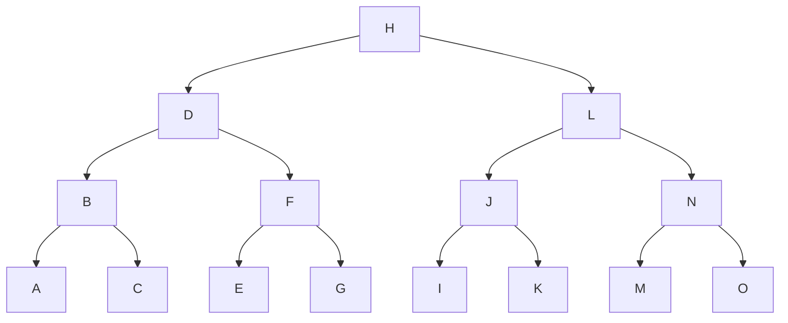

# ELIB

The datastructures and algorithms created in this library are part of some exercises at the Lucerne University of Applied Sciences and Arts.

I do not have much experience with rust. No guarantee that the datastructures all work as intended.

To analyze and describe the algorithms made for the custom data structures, I use the
*Big O-Notation*, which is a tool used to describe the time complexity of algorithms.

## Binary Search Tree

A binary tree allows us to do an easy binary search of items in a large dataset.
Using a binary tree, we can reduce the time complexity from O(N) to O(log N)

### What a binary tree looks like



### Implementation

This struct defines a binary tree data structure. The tree is generic over a type T that must
implement the [PartialEq](https://doc.rust-lang.org/std/cmp/trait.PartialEq.html) and 
[PartialOrd](https://doc.rust-lang.org/std/cmp/trait.PartialOrd.html) traits.
The PartialEq trait allows quality comparison and the PartialOrd trait is used for types that form a partial order. The operators `gt`, `gte`, `lt`, `lte` can be called using the `>`, `>=`, `<`, `<=` operators.

```rust
pub struct TreeNode<'a, T: PartialEq + PartialOrd> {     
    pub val: &'a T,
    pub left: Option<Box<TreeNode<'a, T>>>,
    pub right: Option<Box<TreeNode<'a, T>>>
}
```

The `<'a>` [specific lifetime specifier](https://doc.rust-lang.org/rust-by-example/scope/lifetime/explicit.html) indicates that the references to values of type T stored in the tree have a lifetime that is at least as long as that of the tree itself.

The `#[derive(Debug)]` attribute is a macro that automatically implements the Debug trait for
the `TreeNode` struct, allowing it to be printed in a readable format for debugging purposes.

For the sub-nodes in the TreeNode struct we use `Option<Box<TreeNode<T>>>` which allows for the child nodes to be optional. 
Meaning, that we can set the subnodes to `None`, if there is no sub-node. The `Box<T>` allows for the nodes to be allocated
on the heap, rather the stack, which is necessary for recursive data structures. 
In Rust, we can only allocate fix sized values onto the stack. This is not possible here, because its generic and rust therefore
does not know how much memory to allocate on the stack.

```rust
pub left: Option<Box<TreeNode<'a, T>>>,
pub right: Option<Box<TreeNode<'a, T>>>
```

#### Insert

With the implementation of the insert function, we do not allow duplicate values in our tree. It inserts the values depending on how the `partial_cmp` is implemented in the object type to insert.

```rust
pub fn insert(&mut self, new_val: &'a T) {
    if *self.val == *new_val {
        return
    }
    let target_tree_node: &mut Option<Box<TreeNode<T>>> = if new_val < self.val { &mut self.left } else {&mut self.right };

    // traverse trough the tree to determine where to insert the value
    match target_tree_node{
        &mut Some(ref mut sub_tree_node) => sub_tree_node.insert(new_val),
        &mut None => {
            let new_tree_node = TreeNode { val: new_val, left: None, right: None};
            let boxed_tree_node: Option<Box<TreeNode<T>>> = Some(Box::new(new_tree_node));
            *target_tree_node = boxed_tree_node; // assign the value of boxed node to the memory location pointed to by the mut ref
        }
    }
}
```
#### Search

The search function searches for a value in the binary search tree. If the data inserted in the tree is inserted in the right order, so that the tree is balanced, we can with every node we look at while searching get rid of half of the remaining nodes. This way we can search way faster trough the tree.

```rust
pub fn search(&self, value_to_find: &'a T) -> Option<&'a T> {
    //partial_cmp returns Ordering:Less, if value_to_find is greater than self.val
    match self.val.partial_cmp(value_to_find) {
        Some(Ordering::Equal) => return Some(self.val),
        Some(Ordering::Less) => match &self.right {
            Some(ref right_node) => right_node.search(value_to_find),
            None => return None,
        },
        Some(Ordering::Greater) => match &self.left {
            Some(ref left_node) => left_node.search(value_to_find),
            None => return None,
        },
        None => return None,
    }
}
```

#### Contains

The contains function returns true or false depending on if the value we are looking for is in the tree.

```rust
pub fn contains(&self, value_to_find: &'a T) -> bool {
    match self.search(value_to_find) {
        Some(_) => return true,
        None => return false,
    }
}
```

### Using hashchodes as keys

In order to use hashcodes as a `key` to search for an item (node), we do not have to alter the implementation. We can implement `Hash` in our type which is saved in our tree and then adjust the `partial_cmp` of `PartialOrd` to compare the hashes.

Example:
```rust
use std::cmp::Ordering;
use std::collections::hash_map::DefaultHasher;
use std::hash::{Hash, Hasher};

#[derive(Debug, PartialEq)]
pub struct Person {
    pub id: u32,
    pub name: String,
    pub age: u16,
}

impl Hash for Person {
    fn hash<H: Hasher>(&self, state: &mut H) {
        self.id.hash(state);
        self.name.hash(state);
        self.age.hash(state);
    }
}

impl PartialOrd for Person {
    fn partial_cmp(&self, other: &Self) -> Option<Ordering> {
        let mut hasher1 = DefaultHasher::new();
        self.hash(&mut hasher1);
        let hash1 = hasher1.finish();

        let mut hasher2 = DefaultHasher::new();
        other.hash(&mut hasher2);
        let hash2 = hasher2.finish();

        hash1.partial_cmp(&hash2)
    }
}
```