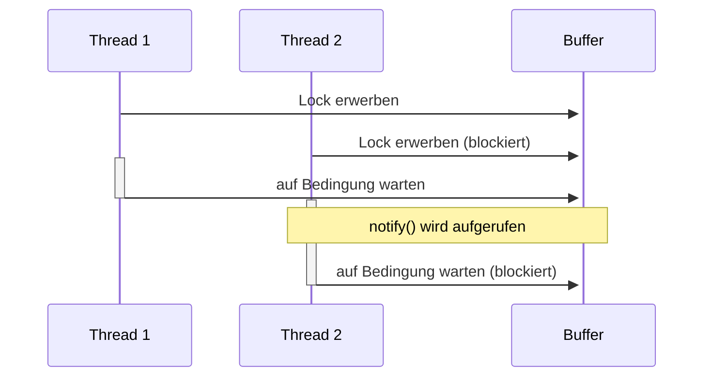

# Bounded Buffer

## Was ist ein Bounded Buffer

Ein Bounded Buffer ist eine Datenstruktur, die zur Synchronisation und Kommunikation zwischen Prozessen oder Threads verwendet wird. Es ist im Wesentlichen eine begrenzte Warteschlange, die eine feste Anzahl von Elementen speichern kann.

Die Funktionsweise eines Bounded Buffers beruht darauf, dass es zwei Operationen gibt, die auf den Buffer ausgeführt werden können: "Schreiben" `add()` und "Lesen" `remove()`. Ein Prozess kann ein Element in den Buffer schreiben, indem es das Element in die Warteschlange einfügt. Ein anderer Prozess kann ein Element aus dem Buffer lesen, indem es das erste Element aus der Warteschlange entfernt.

Wenn der Buffer voll ist, kann ein Schreibprozess nicht schreiben, bis ein Leseprozess ein Element aus dem Buffer entfernt hat. Umgekehrt kann ein Leseprozess nicht lesen, wenn der Buffer leer ist, bis ein Schreibprozess ein Element in den Buffer geschrieben hat. Dadurch wird sichergestellt, dass die Warteschlange nicht überläuft oder dass ein Prozess versucht, auf ein leeres Array zuzugreifen.

Ein Bounded Buffer ist daher besonders nützlich bei der Implementierung von parallelen oder asynchronen Systemen, in denen mehrere Prozesse oder Threads auf gemeinsame Daten zugreifen müssen, aber die Synchronisation und Koordination der Zugriffe gewährleistet sein muss.

## 4.4 Reflektion

### Warum ist es gerade im Fall der Klasse `BoundedBuffer` nicht gut, wenn man als Lock- und Wait-Pool das aktuelle Objekt `this` nimmt?

Ein privates Lock-Objekt in der Klasse `BoundedBuffer` ist in der Tat eine bessere Option, da es verhindert, dass externe Threads unerwartet auf den Lock-Objekt zugreifen können. Da das Lock-Objekt privat ist, kann es nur von internen Methoden der Klasse BoundedBuffer verwendet werden, was das Risiko von Konflikten mit anderen Threads reduziert. Dadurch wird die Wahrscheinlichkeit von Deadlocks und anderen Problemen, die bei gemeinsamer Nutzung von Ressourcen auftreten können, reduziert.

Ein Bounded Buffer ist ein synchronisierter Datenpuffer, der von mehreren Threads gleichzeitig verwendet werden kann. Die Threads führen verschiedene Operationen am Buffer durch, wie das Einfügen von Elementen in den Buffer oder das Entfernen von Elementen aus dem Buffer. Um sicherzustellen, dass die Operationen korrekt und synchronisiert ausgeführt werden, müssen Locks verwendet werden, um die Threads daran zu hindern, gleichzeitig auf den Buffer zuzugreifen.

Wenn das aktuelle Objekt (`this`) als Lock-Objekt verwendet wird, wird der Lock auf dem gesamten Objekt und somit auf allen Operationen am Buffer angewendet. Das bedeutet, dass ein Thread, der auf ein Element im Buffer wartet, den Lock blockiert hält, während ein anderer Thread den Lock benötigt, um eine andere Operation am Buffer durchzuführen. => Dadurch kann ein Deadlock entstehen? Fragen!

Da ein Bounded Buffer ein häufig verwendetes Datenstruktur ist, bei der viele Threads gleichzeitig auf den Lock zugreifen müssen, ist es besonders wichtig, hier geeignete Lock-Objekte zu verwenden, um Deadlocks und Verzögerungen zu vermeiden.

### Wieso macht es gerade beim BoundedBuffer Sinn `notifyAll` und nicht nur `notify` zu verwenden?



In diesem Beispiel wird `notify()` aufgerufen, um Thread 1 zu benachrichtigen, dass eine Operation abgeschlossen ist. Allerdings kann es passieren, dass Thread 2 den Lock auf dem Buffer-Objekt blockiert hat und nicht sofort benachrichtigt wird, wenn die `notify()`-Methode aufgerufen wird.

Dies bedeutet, dass Thread 2 weiterhin blockiert bleibt, obwohl eine Operation abgeschlossen wurde, was zu einer Verzögerung im System führen kann. Thread 2 wird erst benachrichtigt, wenn er den Lock auf dem Buffer-Objekt erwerben kann, was erst möglich ist, wenn Thread 1 den Lock freigibt.

Um dieses Problem zu vermeiden, sollte die `notifyAll()`-Methode anstelle von `notify()` verwendet werden. Dadurch wird sichergestellt, dass alle wartenden Threads benachrichtigt werden, sobald eine Operation abgeschlossen ist, und nicht nur einer von ihnen.

### Wieso macht es Sinn notifyAll nur aufgrund einer Bedingung aufzurufen (wie in der Klasse BoundedFIFOQueue)?

1. Effizienz: Wenn Sie `notifyAll()` ohne eine Bedingung aufrufen, werden alle Threads, die auf das Objekt warten, benachrichtigt, unabhängig davon, ob sie bereit sind, ihre Arbeit fortzusetzen oder nicht. Dies kann zu unnötigen Wake-ups und Wettlaufsituationen führen, was die Leistung des Systems beeinträchtigen kann. Indem Sie `notifyAll()` nur dann aufrufen, wenn eine bestimmte Bedingung erfüllt ist, stellen Sie sicher, dass nur diejenigen Threads aufgeweckt werden, die bereit sind, ihre Arbeit fortzusetzen.

2. Vermeidung von verlorenen Benachrichtigungen: Wenn Sie `notify()` anstelle von `notifyAll()` verwenden und ein Thread aus irgendeinem Grund während des Wartens aufgewacht ist, aber die Bedingung, auf die er wartet, nicht erfüllt ist, wird der Thread wieder schlafen gelegt. Wenn Sie später `notifyAll()` aufrufen, um andere wartende Threads zu wecken, wird der ursprüngliche Thread möglicherweise nicht benachrichtigt, da er bereits aufgewacht ist und die Benachrichtigung verpasst hat. Durch die Verwendung von `notifyAll()` nur aufgrund einer Bedingung können Sie sicherstellen, dass alle wartenden Threads korrekt benachrichtigt werden.

Insgesamt ist es also sinnvoll, `notifyAll()` nur aufgrund einer bestimmten Bedingung aufzurufen, um die Leistung des Systems zu verbessern und verlorenen Benachrichtigungen vorzubeugen.

### Sie haben bei denjenigen Methoden wo eine InterruptedException auftreten kann, diese an den Aufrufer weitergegeben. Warum haben Sie das getan?

In diesem Fall ist es eine gute Praxis, die `InterruptedException` an den Aufrufer weiterzugeben, damit er weiss, dass der Thread unterbrochen wurde und entsprechend darauf reagieren kann. Der Aufrufer kann die Ausnahme dann entweder selbst behandeln oder sie an eine höhere Schicht in der Anwendung weiterleiten, die in der Lage ist, die Ausnahme angemessen zu behandeln. Einige gängige Verfahren zur Behandlung von InterruptedException sind das Zurücksetzen des Interrupt-Flags des Thread und das Beenden des Threads.

Es gibt also dem Aufrufer die Kontrolle über den Thread und ermöglicht ihm, die Unterbrechung des Threads sicher und effektiv zu behandeln.

_Side Note: Dies wurde im Aufgaben-Template auch für die `IllegalArgumentExceptions` gemacht, was ich jedoch weniger sinnvoll finde. Dies habe ich entsprechend angepasst. Dies ist kein schönes API design. Für etwas gibt es API documentation._

### Wie verhält sich Ihr BoundedBuffer beim Eintreffen eines Interrupts? Haben Sie das ausprobiert?

Normale Ausführung:

```bat
[INFO ] - Consumer get timeout
[INFO ] - Prod A = 16054611
[INFO ] - Prod B = 9943570
[INFO ] - Prod C = 35250606
[INFO ] - Cons A = 31515694
[INFO ] - Cons B = 29733093
[INFO ] - 61248787 = 61248787
[INFO ] - queue size = 0
[INFO ] - queue empty? true
```

Mit Interrupt:

```bat
[INFO ] - Producer put timeout
[INFO ] - Producer put timeout
[INFO ] - Producer put timeout
[INFO ] - Prod A = 351
[INFO ] - Prod B = 253
[INFO ] - Prod C = 0
[INFO ] - Cons A = 0
[INFO ] - Cons B = 0
[INFO ] - 604 = 0
[INFO ] - queue size = 50
[INFO ] - queue empty? false
```
