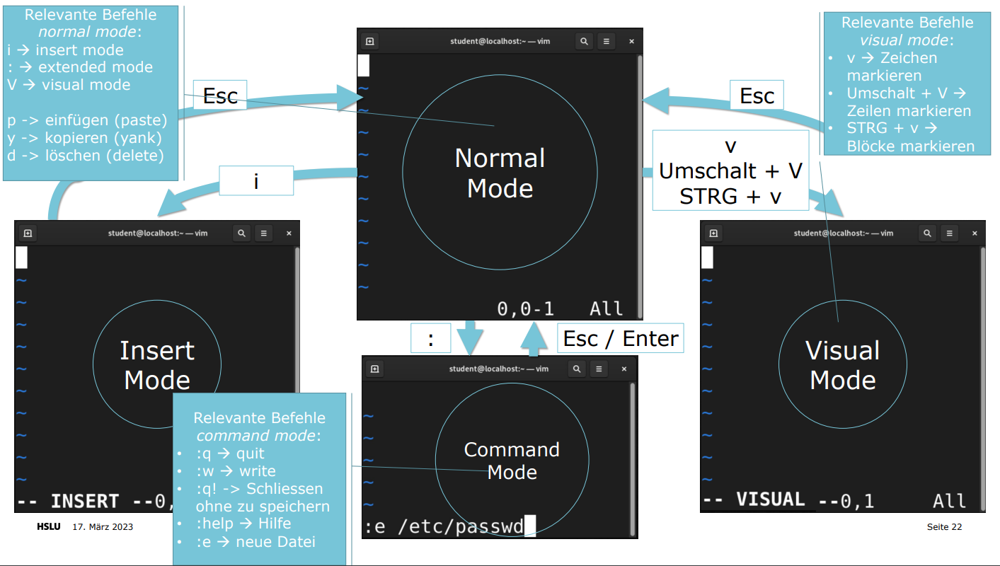

# LIOS Summary

Zusammenfassung von Eldar Omerovic zum Modul LIOS

Zusammenfassung der Stoffabgrenzung.

- [ ]  Alle scharfen ss aus dem deutschen mit ss ersetzen.

# 1.0 Befehlszeile, Linux Dateisystem, Dateien und Verzeichnisse

## 1.1 Anmelden bei einem Linux-System und Ausführen einfacher Befehle über die Shell

Die Verbindung über RDP stellt beispielsweise eine Verbindung im Grafikmodus her und ist hiermit für uns ein Terminal, das Eingaben per Tastatur oder Maus entgegennimmt und Ausgaben auf dem lokalen Bildschirm ausgibt.

Die Verbindung über SSH (Secure Shell) ist beispielsweise im Textmodus. Hier sind keine grafischen Ausgaben möglich. Mit Hilfe von SSH steht ein Terminal im Textmodus zur Verfügung.

**Kommandozeile, Befehlszeile oder Eingabeaufforderung**

- Ist ein Computerprogramm, das eine Textzeile als Eingabe vom Benutzer entgegennimmt und verarbeitet

**Interpreter (Shell)**

- Ist Teil der Befehlszeile
- Interpretiert die Eingabe
- Zerlegt die Eingabe
- Bietet Hilfe bei der Eingabe und bezieht den Kontext mit ein, beispielsweise das aktuelle Verzeichnis

**Befehlsaufbau**

```bash
ls -l /home
```

Hier ist `ls` der Command, `-l` die Option und `/home` das Argument (oder Parameter)

**Befehlszeile mit Bash Shell**

Normaler Benutzer → Standardeingabeaufforderung endet mit einem `$`-Zeichen

```bash
[user@host ~]$
```

Root / Super user / Administrator → Standardeingabeaufforderung endet mit einem `#`-Zeichen

```bash
[user@host ~]#
```

Die Tastenfolge STRG (CTRL) + C dient zum Unterbrechen eines laufenden Befehls.

### Login im Textmodus

Linux bietet mehrere Konsolen, die separate Terminals ausführen können. Jede virtuelle Konsolle unterstützt eine unabhängige Anmeldesitzung.

- Wechsel mit gleichzeitig CTRL+ALT und eine Funktionstate (F1 bis F6)
- In Rocky Linux 8.5: Grafischer Login auf tty (F1). Auf Konsolen zwei F2) bis sechs (F6) sind fünf Text-Terminals verfügbar.
- Die meisten dieser virtuellen Konsolen führen ein Terminal aus, das eine Text-Anmeldeaufforderung bereitstellt → Benutzernamen und Passwort korrekt eingeben → Befehlszeile

### Login über Netzwerk

Linux Administratoren müssen häufig Shell-Zugriff auf ein Remote-System erhalten, indem sie sich über das Netzwerk mit ihm verbinden. In einer modernen Computerumgebung sind viele Headless-Server tatsächlich virtuelle Maschinen oder werden als öffentliche oder private Cloud-Instanzen ausgeführt. Diese Systeme sind nicht physisch und haben keine echten Hardwarekonsolen.

- Häufigste Methode ist die Verwendung von Secure Shell (SSH)
- Die meisten Linux-Systeme und macOS stellen zu diesem Zweck das OpenSSH-Befehlszeilenprogramm ssh bereit.

```bash
[user@host ~]$ ssh remoteuser@remotehost
remoteuser@remotehost's password: *******
[remoteuser@remotehost ~]$
```

Aus Sicherheitsgründen gestatten einige Systeme Benutzern nicht ein Kennwort für die Anmeldung mit ssh zu verwenden. Eine Alternative Methode ist das Verwenden von Public und private Key-Pairs. 

```bash
[user@host ~]$ ssh -i key.pem remoteuser@remotehost
[remoteuser@remotehost ~]$
```

<aside>
ℹ️ Beim ersten Anmelden auf einem neuen Computer, erhält man die Warnung von ssh, dass die Authentizität des Hosts nicht festgestellt werden kann!

</aside>

### Abmelden und Herunterfahren

Beim Beenden einer Sitzung kann CTRL + D gedrückt oder folgender Befehl ausgeführt werden.

```bash
[user@host ~]$ exit
```

Wenn man ein System herunterfahren möchte, nutzt man folgenden Befehl:

```bash
[user@host ~]$ sudo shutdown -h now
```

## 1.2 Umgang mit Dateien und Verzeichnissen

Das Linuxdateisystem ist wie ein umgekehrter, hierarchischer Baum aufgebaut. Dessen Wurzel das Verzeichnis `/` ist.

**Absoluter Pfad**

Ein Absoluter Pfad ist der Weg zu einer Datei oder eines Verzeichnisses, von der Wurzel aus:

```bash
/home/labstudent/scripts/hello.sh
```

**Relativer Pfad**

Ein relativer Pfad beschreibt den Weg zu einer Datei oder einem Verzeichnis von der aktuellen Position im Dateisystem:

```bash
../otherscripts/other.sh
```

<aside>
ℹ️ Dabei bezieht man sich bei einem `.` auf das aktuelle Directory und mit `..` auf das übergeordnete Directory.

</aside>

### Top-Level des Dateisystem

- `/bin` ist ein symbolischer Link zu `/usr/bin`. An dieser Stelle befinden sich Programme (binaries).
- `/boot` enthält Dateien, die zum Starten und für den Bootvorgang nötig sind.
- `/dev` enthält spezielle Gerätedateien, die vom System für den Zugriff auf Hardware verwendet werden. Von **dev**ices (Geräte) abgeleigtet.
- `/etc` enthält die Konfigurationsdateien und Dateien mit Einstellungen für das gesamte System. Der Name etc wurde ursprünglich von **et cetera** (alles übrige) abgeleigtet, später auch von: **e**ditable **t**ext **c**onfiguration
- `/home`: Im Home Verzeichniss speichern normale Benutzer ihre persönlichen Daten und Konfigurationsdateien.
- `/root`: Home-Verezichnis für den administrativen Superuser root.
- `/run` speichert Laufzeitdaten für Prozesse, die seit dem letzten Start gestartet wurden. Dazu gehören unter anderem Prozess-ID-Dateien und Lock-Dateien (Sperrdateien). Der Inhalt dieses Verzeichnisses wird beim Neustart neu erstellt.
- `/sbin` ist ein symbolischer Link zu `/usr/sbin`. Von: **s**ystem **bin**aries (Systemprogramme)
- `/tmp` ist ein systemweit beschreibbarer Speicherplatz für temporäre Dateien. Dateien die 10 Tage lang nicht aufgerufen, geändert oder modifiziert wurden, werden automatisch aus dem Verzeichnis gelöscht. Es exisitert ein weiteres temporäres Verzeichnis `/var/tmp`, in dem Dateien, auf die länger als 30 Tage nicht zugegriffen oder etwas geändert wurde, automatisch gelöscht werden.
- `/usr` speichert von Usern installierte Software, gemeinsam genutzte Bibliotheken (`/usr/lib`), Include-Dateien und schreibgeschützte Programmdaten. Wichtige Unterverzeichnisse sind:
    - `/usr/bin`: Benutzer-Commands für die Befehlszeile
    - `/usr/sbin`: Systemverwaltungs-Commands für die Befehlszeile als Superuser root, bsp: `shutdown`
    - `/usr/local`: Lokal angepasste Software
- `/var` speichert variable Daten, die für dieses System spezifisch sind und zwischen Bootvorgängen bestehen bleiben sollten. Dateien, die sich dynamisch ändern, wie Datenbanken, Cache-Verzeichnisse, Protokolldateien, vom Drucker gespoolte Dokumente und Website-Inhalte können unter `/var` gefunden werden.

### Wichtigste Dateisystembefehle

- `whoami`: Zeigt aktuellen User an
- `pwd`: Zeigt aktuelles Verzeichniss an
- `ls`: Listet Untervzeichnisse und Dateien auf
- `cd`: Ändert das Verzeichnis
- `cat`: Aufzeigen des Inhalts einer Datei auf dem Terminal
- `head`: Zeigt die ersten 10 Zeilen einer Datei im Terminal
- `tail`: Zeigt die letzten 10 Zeilen einer Date im Terminal
- `wc`: Zählt die Anzahl Zeilen, Worte und Zeichen einer Datei
`wc file.txt` → `1 6 18 file.txt` bedeutet: 1 Zeile, 6 Wörter, 18 Zeichen

This will save the output from the command `wc file.txt` into a file named `stdout.txt`

# 2.0 Shell Expansions, Hilfe, Bash Shortcuts und Pipes

## 2.1 VIM




## 2.2 Erstellen, Kopieren, Verschieben und Entfernen von Dateien und Verzeichnissen

- `mkdir`: Verzeichnis erstellen
- `cp`: File kopieren
- `cp -r`: Verzeichnis kopieren
- `mv`: Datei verschieben
- `rm`: Datei löschen
- `rm -r`: Verzeichnis / Dateien aus Verzeichnissen löschen

## 2.3 Hard- and Softlinks

Softlinks im Linux sind Verweise auf eine Datei während bei einem Hardlink eine Spiegelkopie dieser Datei ist. Das Löschen der Orginaldatei macht einen Softlink wertlos, ein Hardlink jedoch würde die Informationen der gelöschten Datei noch in sich tragen.

Hardlinks und Softlinks erstellen (mit `-s` wird ein Softlink erstellt):

```bash
ln stdout.txt stdoutlink
ln -s stdout.txt stdoutsoftlink
```

```bash
-rw-rw-r--.  2 labstudent labstudent   18 Jun 28 15:29 stdoutlink
lrwxrwxrwx.  1 labstudent labstudent   10 Jun 28 15:56 stdoutsoftlink -> stdout.txt
-rw-rw-r--.  2 labstudent labstudent   18 Jun 28 15:29 stdout.txt
```

Die `-f` Option zwingt den Command dazu, ein bereits existierendes File zu überschreiben 
→ `ln -s -f stdout.txt mylink`

## 2.4 Wildcards & Pattern-Matching

### Wildcards

***-Wildcard**

- 0 oder mehr Characters
- Any Characters
- z.B `abc.txt` matches `*.txt`

**?-Wildcard**

- Genau 1 Character
- Any Character
- z.B. `a.txt` matches `?.txt`

**[]-Character-Klasse**

- Alle Charakter, die sich in den Klammern befinden
- Genau 1 dieser Charakter
- z.B. `wat` und `wan` do match `wa[nt]`

**[^]-Negierung der Character-Klasse**

- Alle Charakter, die sich nicht in den Klammern befinden
- Genau 1 dieser Charakter
- z.B. `chap1`, `chap4`, `chap5` match `chap[^23]`

**[x-y]-Range**

- Alle Charakter in dieser Range (in diesem Spektrum von, bis)
- Genau 1 dieser Charakter
- [a-f]* matched alle Dokumente beginnend mit a, b, c, d, e, f
- z.B. `alley.txt`, `cooling.log`, `forcing.pem` match `[a-f]*`

**\\-Escape**

- Wird verwendet wenn ein Charakter als Wildcard verwendet werden soll
- Genau 1 dieser Charakter
- *\? matched allen Dokumente die mit einem ? enden
- `what?` matches `*\?`

# 3.0 Pipes, VIM, Fernverwaltung SSH

## 3.1 Pipes (Pipelines) & Umleitung

Pipes und Umleitung manipulieren sowohl die Standardausgabe als auch die Standardeingabe. Umleitungen senden die Ausgabe an Dateien oder rufen Standardeingaben von Dateien ab. Pipes senden die Standardausgaben eines Prozesses an die Standardeingabe eines anderen Prozesses.

```bash
[labstudent@xyz ~]$ ls | sort -r
```

Zum Beispiel können wir dies verwenden um in einer grossen Ausgabe nach einem Wort zu filtern mithilfe `grep`.

```bash
[labstudent@lios-workstation-48 Documents]$ ls -la
total 16
drwxr-xr-x.  2 labstudent labstudent   80 Jun 28 15:56 .
drwx------. 18 labstudent labstudent 4096 Jun 28 15:07 ..
-rw-rw-r--.  1 labstudent labstudent   18 Jun 28 15:07 nice.txt
-rw-rw-r--.  2 labstudent labstudent   18 Jun 28 15:29 stdoutlink
lrwxrwxrwx.  1 labstudent labstudent   10 Jun 28 15:56 stdoutsoftlink -> stdout.txt
-rw-rw-r--.  2 labstudent labstudent   18 Jun 28 15:29 stdout.txt
[labstudent@lios-workstation-48 Documents]$ ls -la | grep nice
-rw-rw-r--.  1 labstudent labstudent   18 Jun 28 15:07 nice.txt
```

Hier sehen wir, dass wir mit dem `ls -la` einige Resultate sehen. Wenn wir jedoch denselben Befehl mit `grep` nice ausführen (gepiped, verkettet) wird das Resultat so filtriert, dass nur noch die Resultate in denen das Pattern `nice` ein match ist.


## 3.2 Konfigurieren eines Benutzerkontos mit schlüsselbasierter Authentifizierung für eine sichere und passwortlose Anmeldung auf Remote-Systeme

**Schritt 1: Erstellen von SSH Schlüsseln**

```bash
ssh-keygen -t rsa -b 4096
```

Die Optionen können alle ausgelassen werden und mit ENTER übersprungen werden.

**Schritt 2 (1): Kopieren des öffentlichen schlüssels auf einen Server**

Mithilfe cat geben wir den public key `/home/<user>/.ssh/id_rsa.pub` aus:

```bash
[labstudent@lios-workstation-48 .ssh]$ cat id_rsa.pub
ssh-rsa AAAAB3NzaC1yc2EAAAADAQABAAACAQDC2DHInZkftLPWiqHELcTXWprsd6nnYSalJBXebTg50l7RK+l
NbrvcEUz7THtbsYE79fNXYIo6iyJz2PD/AC+IK8j/6VRZ4Z8tzyLIi0/F+GPi0JMZbcPF4GyyqaDs/z3PKnVfbj
N7gPhBa+21vBNnRbgD/u2hmj3oC8h/p0m5KaokeVSszrtdH2QFUOwaWX2fCkAD/03RRE1H3ifHJEkzaSe1i+4TN
emUyYWynLz1fXH+NyF8yWWuDvTeCQTymHpOCPa/HPT+MQQSDjKGrMJfC6pXK3s/Thg6DTSwhUSBCVMN8KlqqK7f
uuO91v7JrvgMi3uEC7UaBXeE4AGUnRR+rv3hxxtUZNz9C9SgDt5DNk8mOh+V4XDCyuoj8FSs+pbsmdimKB+IONu
3gzovKKBVCnWC8wz/JKuGVtM7EqXinY8QmMFNQx5GCx1bQYix29lTKIEQu8IAusVszKveoH6y2oLsWB5urqd/vg
ZhhXyqs13ut9BOn/DgRLFRHlCHO1Vn0m/qD8IoWZeGQPAthFQZaP27VLLMyhkeQ274Ic22AHVHU9kwPiNsIzpac
WhV7SCyvVRetL2XJQ1LYHfqcDxsODMyS52+HbvA2zvYnWG7Hv3bgQ/9J8E/It3bnRZedTmeu9jQxppHx7mKPv0U
k5UO+uaZxNuC/0iqeFbB86VCVw== labstudent@lios-workstation-48
```

Den Key kopieren wir jetzt in die Zwischenablage und machen auf einem Server ein `.ssh/authorized_keys` File, in das wir unseren Public Key kopieren.

Auf diesem Ordner und File müssen wir die Berechtigung anpassen:

```bash
chmod 600 .ssh/authorized_keys
chmod 700 .ssh
```

**Schritt 3: Authentifizieren an dem Server mit SSH-Schlüssel**

Nun sollte das Anmelden per SSH ohne Passwort funktionieren.

**Schritt 2 (2): Kopieren des öffentlichen Schlüssel via `ssh-copy-id`**

```bash
ssh-copy-id labstudent@lios-server-48.el.eee.intern
```

## 3.3 Deaktivieren der direkten Anmeldung als root und der passwortbasierten Authentifizierung für den OpenSSH-Service

**Schritt 4: Deaktivieren der Passwort-Authentifizierung auf einen Server**

Konfigurationsdatei des SSH-Daemons muss angepasst werden (`/etc/ssh/sshd_config`)

```bash
PasswordAuthentication yes
```

Dieses Property muss auf no gesetzt werden. Dann muss das File gespeichert und der sshd service neu gestartet werden.

```bash
sudo systemctl restart sshd
```

# 4.0 Nutzer- und Rechtemanagement

## 4.1 Zweck von Benutzern und Gruppen

Für den Zugriffsschutz auf gewisse Ressourcen. Gruppen werden verwendet, dass man nicht einzelnen Personen immer alle Berechtigungen zuweisen muss, sondern damit man nur Gruppen berechtigen muss und jede Person in der Gruppe die angepassten Berechtigungen erhält.

## 4.2 Wechseln zum Superuser

```bash
sudo su
```

## 4.3 Erstellen, Ändern und Löschen lokaler Benutzerkonten

Um lokale Benutzerkonten in Rocky Linux zu erstellen, zu ändern und zu löschen, können Sie die folgenden Schritte ausführen:

Erstellen eines lokalen Benutzerkontos:

1. Öffnen Sie das Terminal oder eine Befehlszeilenschnittstelle.
2. Geben Sie den Befehl **`sudo useradd -m <Benutzername>`** ein und drücken Sie die Eingabetaste. Ersetzen Sie **`<Benutzername>`** durch den gewünschten Benutzernamen.
Beispiel: **`sudo useradd -m john`**
3. Geben Sie ein Passwort für den Benutzer ein, wenn Sie dazu aufgefordert werden, und bestätigen Sie es. Beachten Sie, dass beim Eingeben des Passworts keine Zeichen angezeigt werden.
4. Das Benutzerkonto wurde erfolgreich erstellt.

Ändern eines lokalen Benutzerkontos:

1. Öffnen Sie das Terminal oder eine Befehlszeilenschnittstelle.
2. Geben Sie den Befehl **`sudo usermod -l <neuer Benutzername> <alter Benutzername>`** ein und drücken Sie die Eingabetaste. Ersetzen Sie **`<neuer Benutzername>`** durch den neuen Benutzernamen und **`<alter Benutzername>`** durch den aktuellen Benutzernamen.
Beispiel: **`sudo usermod -l jsmith john`**
3. Das Benutzerkonto wurde erfolgreich umbenannt.

Löschen eines lokalen Benutzerkontos:

1. Öffnen Sie das Terminal oder eine Befehlszeilenschnittstelle.
2. Geben Sie den Befehl **`sudo userdel -r <Benutzername>`** ein und drücken Sie die Eingabetaste. Ersetzen Sie **`<Benutzername>`** durch den Benutzernamen, den Sie löschen möchten.
Beispiel: **`sudo userdel -r john`**
3. Geben Sie Ihr Root-Passwort ein, wenn Sie dazu aufgefordert werden.
4. Das Benutzerkonto wurde erfolgreich gelöscht. Die Option **`r`** entfernt auch das Benutzerverzeichnis und alle damit verbundenen Dateien.

Bitte beachten Sie, dass diese Schritte administrative Rechte erfordern. Verwenden Sie daher **`sudo`**, um die Befehle mit entsprechenden Berechtigungen auszuführen.

## 4.4 Erstellen, Ändern und Löschen lokaler Gruppenkonten

Um lokale Gruppenkonten in Rocky Linux zu erstellen, zu ändern und zu löschen, können Sie die folgenden Schritte ausführen:

Erstellen einer lokalen Gruppe:

1. Öffnen Sie das Terminal oder eine Befehlszeilenschnittstelle.
2. Geben Sie den Befehl **`sudo groupadd <Gruppenname>`** ein und drücken Sie die Eingabetaste. Ersetzen Sie **`<Gruppenname>`** durch den gewünschten Namen der Gruppe.
Beispiel: **`sudo groupadd mygroup`**
3. Die Gruppe wurde erfolgreich erstellt.

Ändern einer lokalen Gruppe:

1. Öffnen Sie das Terminal oder eine Befehlszeilenschnittstelle.
2. Geben Sie den Befehl **`sudo groupmod -n <neuer Gruppenname> <alter Gruppenname>`** ein und drücken Sie die Eingabetaste. Ersetzen Sie **`<neuer Gruppenname>`** durch den neuen Namen der Gruppe und **`<alter Gruppenname>`** durch den aktuellen Namen der Gruppe.
Beispiel: **`sudo groupmod -n newgroup oldgroup`**
3. Die Gruppe wurde erfolgreich umbenannt.

Löschen einer lokalen Gruppe:

1. Öffnen Sie das Terminal oder eine Befehlszeilenschnittstelle.
2. Geben Sie den Befehl **`sudo groupdel <Gruppenname>`** ein und drücken Sie die Eingabetaste. Ersetzen Sie **`<Gruppenname>`** durch den Namen der Gruppe, die Sie löschen möchten.
Beispiel: **`sudo groupdel mygroup`**
3. Die Gruppe wurde erfolgreich gelöscht.

Bitte beachten Sie, dass diese Schritte administrative Rechte erfordern. Verwenden Sie daher **`sudo`**, um die Befehle mit entsprechenden Berechtigungen auszuführen.

## 4.5 Festlegen einer Richtlinie zur Passwortverwaltung für Benutzer und manuelles Sperren und Entsperren von Benutzerkonten

Um eine Richtlinie zur Passwortverwaltung für Benutzer festzulegen und Benutzerkonten manuell zu sperren und zu entsperren, können Sie die folgenden Schritte in Rocky Linux befolgen:

Festlegen einer Richtlinie zur Passwortverwaltung für Benutzer:

1. Öffnen Sie das Terminal oder eine Befehlszeilenschnittstelle.
2. Geben Sie den Befehl **`sudo vi /etc/pam.d/common-password`** ein und drücken Sie die Eingabetaste. Dadurch wird die Konfigurationsdatei **`common-password`** im Texteditor **`vi`** geöffnet. Sie können auch einen anderen Texteditor Ihrer Wahl verwenden, z. B. **`nano`**.
3. Suchen Sie in der Datei nach der Zeile, die mit **`password requisite pam_pwquality.so`** beginnt.
4. Bearbeiten Sie die Parameter in dieser Zeile, um Ihre gewünschte Passwortrichtlinie festzulegen. Zum Beispiel können Sie Parameter wie **`minlen`** (Mindestlänge des Passworts), **`ucredit`** (Mindestanzahl an Großbuchstaben), **`lcredit`** (Mindestanzahl an Kleinbuchstaben), **`dcredit`** (Mindestanzahl an Zahlen) und **`ocredit`** (Mindestanzahl an Sonderzeichen) anpassen.
Beispiel: **`password requisite pam_pwquality.so minlen=8 ucredit=-1 lcredit=-1 dcredit=-1 ocredit=-1`**
5. Speichern Sie die Änderungen und schließen Sie den Texteditor.

Manuelles Sperren und Entsperren von Benutzerkonten:

1. Öffnen Sie das Terminal oder eine Befehlszeilenschnittstelle.
2. Um ein Benutzerkonto manuell zu sperren, verwenden Sie den Befehl **`sudo usermod --expiredate 1 <Benutzername>`**. Ersetzen Sie **`<Benutzername>`** durch den Namen des Benutzerkontos, das Sie sperren möchten.
Beispiel: **`sudo usermod --expiredate 1 john`**
Dadurch wird das Benutzerkonto "john" für einen Tag gesperrt.
3. Um ein Benutzerkonto manuell zu entsperren, verwenden Sie den Befehl **`sudo usermod --expiredate "" <Benutzername>`**. Ersetzen Sie **`<Benutzername>`** durch den Namen des Benutzerkontos, das Sie entsperren möchten.
Beispiel: **`sudo usermod --expiredate "" john`**
Dadurch wird das Benutzerkonto "john" entsperrt.

Bitte beachten Sie, dass diese Schritte administrative Rechte erfordern. Verwenden Sie daher **`sudo`**, um die Befehle mit entsprechenden Berechtigungen auszuführen.

## 4.6 Einrichten von Linux-Dateisystemberechtigungen für Dateien und Interpretieren der Sicherheitseffekte verschiedener Berechtigungseinstellungen

Der String "drwxrwxrwx" repräsentiert die Berechtigungen für eine Datei oder ein Verzeichnis in einem Linux-Dateisystem. Jeder Buchstabe in dem String steht für eine bestimmte Art von Berechtigung: Lesen (r), Schreiben (w) und Ausführen (x). Der String besteht aus zehn Zeichen, wobei das erste Zeichen den Dateityp angibt und die restlichen neun Zeichen die Berechtigungen für den Eigentümer, die Gruppe und andere Benutzer darstellen.

- Das erste Zeichen (d) gibt den Dateityp an. In diesem Fall handelt es sich um ein Verzeichnis. Andere mögliche Werte sind '-' für eine reguläre Datei, 'l' für einen symbolischen Link und 's' für eine spezielle Datei.
- Die nächsten drei Zeichen (rwx) repräsentieren die Berechtigungen des Eigentümers der Datei. 'r' steht für Lesen (Read), 'w' für Schreiben (Write) und 'x' für Ausführen (Execute). In diesem Fall hat der Eigentümer volle Berechtigungen zum Lesen, Schreiben und Ausführen.
- Die nächsten drei Zeichen (rwx) repräsentieren die Berechtigungen der Gruppe, der die Datei gehört. Auch hier stehen 'r', 'w' und 'x' für Lesen, Schreiben und Ausführen. In diesem Fall hat die Gruppe volle Berechtigungen zum Lesen, Schreiben und Ausführen.
- Die letzten drei Zeichen (rwx) repräsentieren die Berechtigungen für andere Benutzer, die nicht der Eigentümer oder Teil der Gruppe sind. Auch hier stehen 'r', 'w' und 'x' für Lesen, Schreiben und Ausführen. In diesem Fall haben andere Benutzer volle Berechtigungen zum Lesen, Schreiben und Ausführen.

Die Berechtigungen können auch mit oktalen (Base-8) Codes dargestellt werden, die oft mit dem Befehl "chmod" verwendet werden, um die Berechtigungen einer Datei zu ändern. Jeder Buchstabe (r, w, x) wird einer Zahl zugeordnet: r=4, w=2 und x=1. Die oktale Darstellung der Berechtigungen "drwxrwxrwx" wäre demnach 777.

Es ist wichtig zu beachten, dass Berechtigungen sinnvoll verwaltet werden sollten, um die Sicherheit und Integrität von Dateien und Verzeichnissen zu gewährleisten.

## 4.7 Auflisten der Dateisystemberechtigungen für Dateien und Verzeichnisse und Interpretieren der Auswirkungen dieser Berechtigungen auf den Zugriff von Benutzern und Gruppen

```bash
ls -la
```

```bash
drwxr-xr-x.  2 labstudent labstudent    6 Jun 28 14:44 Public
drwx------.  2 labstudent labstudent   57 Jun 28 17:40 .ssh
```


Ausführrechte für Eigentümer erteilen:

```bash
chmod u+x file
```

Gruppe und Rest bekommen Leserechte entzogen:

```bash
chmod g-r, o-r file
```

Alle erhalten Leserechte:

```bash
chmod a+r file
```

Alle erhalten Lese- und Ausführrechte

```bash
chmod a+rx file
```

Nur ein User (Eigentümer) erhhält Lese- und Schreibrechte per 4 + 2 = 6 → 600

```bash
chmod 600 file
```


## 4.8 Ändern der Berechtigungen und Eigentümerschaft von Dateien mit Befehlszeilentools

Um die Berechtigungen und Eigentümerschaft von Dateien in Rocky Linux mit Befehlszeilentools zu ändern, können Sie die folgenden Tools verwenden:

1. **`chmod`**: Mit dem **`chmod`**Befehl können Sie die Berechtigungen einer Datei ändern.
    
    Verwendung: **`chmod <Berechtigungen> <Dateiname>`**
    
    Beispiel: **`chmod 755 myfile.txt`**
    
    In diesem Beispiel werden die Berechtigungen der Datei "myfile.txt" auf 755 gesetzt, was bedeutet, dass der Eigentümer volle Berechtigungen hat (Lesen, Schreiben, Ausführen), die Gruppe Lesen und Ausführen darf, und andere Benutzer ebenfalls Lesen und Ausführen dürfen.
    
2. **`chown`**: Mit dem **`chown`**Befehl können Sie den Eigentümer einer Datei ändern.
    
    Verwendung: **`chown <NeuerEigentümer> <Dateiname>`**
    
    Beispiel: **`chown john myfile.txt`**
    
    In diesem Beispiel wird der Benutzer "john" zum Eigentümer der Datei "myfile.txt".
    
3. **`chgrp`**: Mit dem **`chgrp`**Befehl können Sie die Gruppenzugehörigkeit einer Datei ändern.
    
    Verwendung: **`chgrp <NeueGruppe> <Dateiname>`**
    
    Beispiel: **`chgrp staff myfile.txt`**
    
    In diesem Beispiel wird die Datei "myfile.txt" der Gruppe "staff" zugeordnet.
    

Bitte beachten Sie, dass die oben genannten Befehle administrativen Zugriff erfordern. Verwenden Sie **`sudo`**, um die Befehle mit entsprechenden Berechtigungen auszuführen, wenn Sie nicht als Root-Benutzer angemeldet sind.

Zusätzlich können Sie die Optionen **`-R`** verwenden, um die Berechtigungen und Eigentümerschaft rekursiv auf alle Dateien und Unterverzeichnisse anzuwenden. Zum Beispiel **`chmod -R 755 mydir`** ändert die Berechtigungen aller Dateien und Verzeichnisse im Verzeichnis "mydir" und seinen Unterverzeichnissen auf 755. Seien Sie jedoch vorsichtig bei der Verwendung der rekursiven Option, um unbeabsichtigte Änderungen zu vermeiden.

## 4.9 Steuern der Standardberechtigungen der von Benutzern erstellten Dateien, Erläutern der Auswirkungen besonderer Berechtigungen und Verwenden spezieller und Standard-berechtigungen zum Festlegen des Gruppeneigentümers von in einem Verzeichnis erstellten Dateien


In einem Linux-Dateisystem können Sie die Standardberechtigungen für von Benutzern erstellte Dateien mithilfe der sogenannten umask festlegen. Die umask ist eine Bitmaske, die die Standardberechtigungen einschränkt, die bei der Erstellung einer Datei angewendet werden.

Die umask-Berechtigungen werden von den Standardberechtigungen (normalerweise 666 für Dateien und 777 für Verzeichnisse) subtrahiert, um die tatsächlichen Berechtigungen zu ermitteln, die auf eine neu erstellte Datei angewendet werden. Die umask wird normalerweise als Octalzahl dargestellt.

Die umask kann mit dem Befehl **`umask`** überprüft und geändert werden. Hier sind einige Beispiele:

- Überprüfen der aktuellen umask: **`umask`**
- Ändern der umask auf 022 (Ermöglicht volle Berechtigungen für den Eigentümer und Lese- und Ausführungsberechtigungen für Gruppe und andere): **`umask 022`**
- Ändern der umask permanent, indem Sie die Einstellung in die Konfigurationsdatei `~/.bashrc` oder `~/.profile` hinzufügen.

Besondere Berechtigungen wie Setuid (suid), Setgid (sgid) und Sticky-Bit (t) können die Art und Weise beeinflussen, wie Dateien ausgeführt oder gemeinsam genutzt werden:

- **Setuid (suid)**: Wenn das Setuid-Bit für eine ausführbare Datei aktiviert ist, wird sie mit den Berechtigungen des Eigentümers ausgeführt, anstatt mit den Berechtigungen des ausführenden Benutzers. Dies kann für bestimmte Anwendungen oder Dienstprogramme erforderlich sein, die besondere Berechtigungen benötigen.
- **Setgid (sgid)**: Wenn das Setgid-Bit für ein Verzeichnis aktiviert ist, werden alle neu erstellten Dateien und Verzeichnisse in diesem Verzeichnis mit der Gruppe des übergeordneten Verzeichnisses als Gruppenzugehörigkeit versehen. Dadurch können Benutzer in der Gruppe des Verzeichnisses Dateien gemeinsam nutzen und darauf zugreifen.
- **Sticky-Bit (t)**: Wenn das Sticky-Bit für ein Verzeichnis aktiviert ist, können nur der Eigentümer einer Datei und der Superuser die Datei aus dem Verzeichnis löschen. Dies wird oft auf Verzeichnissen wie `/tmp` angewendet, um die Sicherheit und Integrität von Dateien zu gewährleisten, die von verschiedenen Benutzern verwendet werden.

Um den Gruppeneigentümer von in einem Verzeichnis erstellten Dateien festzulegen, können Sie die Gruppenzugehörigkeit des übergeordneten Verzeichnisses ändern. Wenn das **Setgid-Bit** für das Verzeichnis aktiviert ist, werden alle neuen Dateien und Verzeichnisse darin automatisch mit der Gruppenzugehörigkeit des Verzeichnisses erstellt. Sie können den Befehl **`chgrp`** verwenden, um den Gruppeneigentümer eines Verzeichnisses zu ändern.

Beachten Sie, dass die genaue Verwendung und Auswirkung von speziellen Berechtigungen und Standardberechtigungen von der Linux-Distribution und den Konfigurationseinstellungen abhäng

# 5.0 Logdateien, Management und Überwachung von Diensten

## 5.1 Bestimmen des Status, der Ressourcennutzung und des Eigentümers der auf einem System ausgeführten Programme, um sie zu steuern

Um den Status, die Ressourcennutzung und den Eigentümer der auf einem System ausgeführten Programme zu bestimmen und sie zu steuern, können Sie verschiedene Befehlszeilentools und Systembefehle verwenden. Hier sind einige wichtige Werkzeuge:

1. **`ps`**: Der Befehl **`ps`** (Prozessstatus) gibt Informationen über die aktuell ausgeführten Prozesse auf dem System aus. Verwenden Sie verschiedene Optionen, um spezifische Details anzuzeigen, wie z.B. den Prozessstatus, die Prozess-ID (PID), den Eigentümer, die Ressourcennutzung usw.
    
    Beispiel: **`ps aux`** zeigt eine Liste aller laufenden Prozesse mit ausführlichen Informationen an.
    
2. **`top`**: Der Befehl **`top`** zeigt eine dynamische Übersicht über die laufenden Prozesse an, wobei die Prozesse basierend auf der CPU-Auslastung und der Speicherbelegung geordnet sind. Es werden Informationen wie PID, Benutzer, CPU-Auslastung, Speicherbelegung und vieles mehr angezeigt. Mit **`top`** können Sie Prozesse überwachen und steuern.
3. **`htop`**: Ähnlich wie **`top`** bietet **`htop`** eine interaktive Übersicht über die laufenden Prozesse. Es stellt Informationen in einer benutzerfreundlichen Oberfläche dar und ermöglicht es Ihnen, Prozesse nach verschiedenen Kriterien zu sortieren und Aktionen wie das Beenden von Prozessen auszuführen.
4. **`pgrep`** und **`pkill`**: Der Befehl **`pgrep`** ermöglicht es Ihnen, Prozesse anhand ihres Namens oder anderer Eigenschaften zu suchen und die zugehörigen Prozess-IDs abzurufen. Mit **`pkill`** können Sie Prozesse basierend auf dem Namen oder anderen Attributen beenden.
    
    Beispiel: **`pgrep firefox`** gibt die Prozess-ID für den Firefox-Prozess zurück.
    
5. **`lsof`**: Der Befehl **`lsof`** (List Open Files) zeigt Informationen über die geöffneten Dateien und Prozesse an. Sie können damit überprüfen, welche Prozesse auf eine bestimmte Datei oder ein bestimmtes Verzeichnis zugreifen.
    
    Beispiel: **`lsof /var/log/syslog`** zeigt die Prozesse an, die auf die Systemprotokolldatei "syslog" zugreifen.
    
6. **`ps aux`**, **`top`**, **`htop`**, **`lsof`** und ähnliche Befehle erfordern oft administrative Rechte, um alle Prozesse anzuzeigen. Sie können den Befehl **`sudo`** verwenden, um diese Tools mit entsprechenden Berechtigungen auszuführen.

Diese Tools bieten umfangreiche Möglichkeiten zur Überwachung, Steuerung und Analyse von Prozessen auf einem Linux-System. Sie können Informationen über den Prozessstatus, die Ressourcennutzung, den Eigentümer und andere relevante Details anzeigen, um die Leistung und den Betrieb des Systems zu verwalten und zu optimieren.

## 5.2 Verwalten mehrerer, von derselben Terminalsitzung gestarteter Prozesse mit der Bash-Jobsteuerung

Die Bash-Jobsteuerung ermöglicht es Ihnen, mehrere Prozesse in derselben Terminalsitzung zu verwalten. Sie können Prozesse im Vordergrund ausführen, in den Hintergrund verschieben, anhalten, fortsetzen und beenden. Hier sind einige wichtige Befehle und Techniken zur Verwendung der Bash-Jobsteuerung:

1. Starten von Prozessen im Vordergrund: Um einen Prozess im Vordergrund auszuführen, geben Sie den Befehl einfach direkt in das Terminal ein. Der Prozess wird ausgeführt und gibt seine Ausgabe direkt im Terminal aus. Sie müssen auf die Beendigung des Prozesses warten, bevor Sie weitere Befehle eingeben können.
2. Starten von Prozessen im Hintergrund: Um einen Prozess im Hintergrund auszuführen, fügen Sie ein Ampersand-Zeichen (&) am Ende des Befehls hinzu. Dadurch wird der Prozess gestartet und die Kontrolle sofort an das Terminal zurückgegeben. Sie können weiterhin Befehle eingeben, während der Prozess im Hintergrund läuft.
3. Anzeigen von laufenden Jobs: Verwenden Sie den Befehl **`jobs`**, um eine Liste der laufenden Jobs in der aktuellen Terminalsitzung anzuzeigen. Jeder Job wird mit einer Jobnummer und seinem Status aufgelistet.
4. Wechseln zwischen Vordergrund und Hintergrund: Verwenden Sie den Befehl **`fg`**, um einen Hintergrundprozess in den Vordergrund zu holen. Geben Sie die Jobnummer als Argument an. Verwenden Sie den Befehl **`bg`**, um einen im Hintergrund gestoppten Prozess fortzusetzen.
5. Anhalten von Jobs: Verwenden Sie den Befehl **`Ctrl + Z`**, um einen laufenden Prozess anzuhalten und in den Hintergrund zu verschieben. Der Prozess wird gestoppt, und Sie können ihn später mit den Befehlen **`fg`** oder **`bg`** fortsetzen.
6. Beenden von Jobs: Verwenden Sie den Befehl **`Ctrl + C`**, um einen laufenden Prozess im Vordergrund zu beenden. Verwenden Sie den Befehl **`kill %<Jobnummer>`**, um einen Hintergrundprozess zu beenden.

Diese Techniken ermöglichen es Ihnen, mehrere Prozesse in derselben Terminalsitzung zu verwalten und zwischen ihnen zu wechseln. Sie sind besonders nützlich, wenn Sie gleichzeitig mehrere Aufgaben ausführen oder überwachen möchten. Beachten Sie, dass die Bash-Jobsteuerung nur in der Bash-Shell verfügbar ist und nicht in allen anderen Shells funktioniert.

## 5.3 Verwenden von Befehlen zum Beenden und Kommunizieren mit Prozessen, Definieren der Merkmale eines Daemon Prozesses und Stoppen von Benutzersitzungen und - prozessen

Um Prozesse zu beenden und mit ihnen zu kommunizieren, können Sie verschiedene Befehle verwenden. Hier sind einige wichtige Befehle für die Prozesssteuerung:

1. **`kill`**: Der Befehl **`kill`** wird verwendet, um Prozesse zu beenden, indem er ihnen ein Signal sendet. Standardmäßig sendet der Befehl das Signal SIGTERM, das den Prozess dazu auffordert, sich ordnungsgemäß zu beenden. Die Syntax lautet: **`kill <PID>`** (PID steht für die Prozess-ID). Wenn ein Prozess nicht auf das SIGTERM-Signal reagiert, können Sie das Signal SIGKILL verwenden, das den Prozess sofort beendet. Die Syntax lautet: **`kill -9 <PID>`**. Beachten Sie, dass der Befehl **`kill`** auch den Namen eines Prozesses anstelle der PID akzeptiert.
2. **`killall`**: Der Befehl **`killall`** wird verwendet, um Prozesse anhand ihres Namens zu beenden. Sie können den Befehl verwenden, um alle Prozesse mit einem bestimmten Namen zu beenden. Die Syntax lautet: **`killall <Prozessname>`**. Achten Sie jedoch darauf, den Befehl mit Vorsicht zu verwenden, da er alle laufenden Prozesse mit dem angegebenen Namen beendet.
3. **`pkill`**: Der Befehl **`pkill`** wird verwendet, um Prozesse anhand verschiedener Kriterien wie Name, Benutzer, Gruppe usw. zu beenden. Sie können den Befehl verwenden, um Prozesse anhand von Mustern oder regulären Ausdrücken zu beenden. Die Syntax lautet: **`pkill <Optionen> <Muster>`**.
4. **Daemon-Prozess:** Ein Daemon-Prozess ist ein Hintergrundprozess, der unabhängig von einer Benutzersitzung ausgeführt wird. Daemons werden oft für Systemdienste verwendet und sind in der Regel nicht mit einer spezifischen Benutzersitzung verbunden. Sie werden typischerweise mit speziellen Merkmalen gestartet, wie z.B. das Abkoppeln von der Terminal-Sitzung, das Ignorieren von SIGHUP-Signalen und das Ändern des Arbeitsverzeichnisses. Weitere Informationen zur Erstellung von Daemon-Prozessen finden Sie in der Dokumentation Ihrer spezifischen Linux-Distribution.
5. Beenden von Benutzersitzungen und -prozessen: Um eine Benutzersitzung zu beenden, können Sie den Befehl **`logout`** verwenden. Dadurch wird die aktuelle Sitzung beendet und der Benutzer abgemeldet. Um einzelne Prozesse eines Benutzers zu beenden, können Sie die oben genannten Befehle wie **`kill`**, **`killall`** oder **`pkill`** verwenden, indem Sie die Prozess-ID oder den Namen des Prozesses angeben.

Bitte beachten Sie, dass das Beenden von Prozessen und Benutzersitzungen mit Vorsicht erfolgen sollte. Stellen Sie sicher, dass Sie die Auswirkungen verstehen und dass Sie die benötigten Berechtigungen haben, um diese Aktionen auszuführen.

## 5.4 Definieren des Load Average und Bestimmen von ressourcenintensiven Serverprozessen

Load Average bezieht sich auf die durchschnittliche Anzahl von Prozessen, die sich in der Warteschlange befinden, um von der CPU verarbeitet zu werden, über einen bestimmten Zeitraum. Es misst die Auslastung des Systems und gibt an, wie viele Prozesse darauf warten, von der CPU ausgeführt zu werden.

Das Load Average wird normalerweise in drei Werten angezeigt, die die durchschnittliche Last über verschiedene Zeiträume repräsentieren:

1. Load Average der letzten Minute: Es gibt die durchschnittliche Anzahl der Prozesse an, die sich in den letzten 60 Sekunden in der Warteschlange befunden haben.
2. Load Average der letzten fünf Minuten: Es gibt die durchschnittliche Anzahl der Prozesse an, die sich in den letzten fünf Minuten in der Warteschlange befunden haben.
3. Load Average der letzten 15 Minuten: Es gibt die durchschnittliche Anzahl der Prozesse an, die sich in den letzten 15 Minuten in der Warteschlange befunden haben.

Ein Load Average von 1 bedeutet, dass das System vollständig ausgelastet ist, da sich im Durchschnitt ein Prozess in der Warteschlange befindet. Ein Load Average von 0,5 bedeutet, dass das System im Durchschnitt halb ausgelastet ist, während ein Wert von 2 darauf hinweist, dass sich im Durchschnitt zwei Prozesse in der Warteschlange befinden.

## 5.5 Steuern und Überwachen von Netzwerkservices und System-Daemons mit dem Service systemd

Mit dem Service-Management-System "systemd" können Sie Netzwerkservices und System-Daemons auf Linux-Systemen steuern und überwachen. Systemd ist in den meisten modernen Linux-Distributionen als Standard-Init-System implementiert. Hier sind einige grundlegende Befehle und Techniken, die Sie mit systemd verwenden können:

1. Service starten: Um einen Service zu starten, verwenden Sie den Befehl **`systemctl start <servicename>`**. Zum Beispiel: **`systemctl start apache2`** startet den Apache-Webserver.
2. Service stoppen: Um einen Service zu stoppen, verwenden Sie den Befehl **`systemctl stop <servicename>`**. Zum Beispiel: **`systemctl stop apache2`** stoppt den Apache-Webserver.
3. Service neu starten: Um einen Service neu zu starten, verwenden Sie den Befehl **`systemctl restart <servicename>`**. Zum Beispiel: **`systemctl restart apache2`** startet den Apache-Webserver neu.
4. Service aktivieren: Um einen Service so zu konfigurieren, dass er beim Systemstart automatisch gestartet wird, verwenden Sie den Befehl **`systemctl enable <servicename>`**. Zum Beispiel: **`systemctl enable apache2`** aktiviert den Apache-Webserver.
5. Service deaktivieren: Um einen Service so zu konfigurieren, dass er beim Systemstart nicht automatisch gestartet wird, verwenden Sie den Befehl **`systemctl disable <servicename>`**. Zum Beispiel: **`systemctl disable apache2`** deaktiviert den Apache-Webserver.
6. Status eines Services überprüfen: Um den Status eines Services anzuzeigen, verwenden Sie den Befehl **`systemctl status <servicename>`**. Zum Beispiel: **`systemctl status apache2`** zeigt den Status des Apache-Webservers an, einschließlich Informationen darüber, ob er läuft oder gestoppt ist.
7. Logs eines Services anzeigen: Um die Logs eines Services anzuzeigen, verwenden Sie den Befehl **`journalctl -u <servicename>`**. Zum Beispiel: **`journalctl -u apache2`** zeigt die Logs des Apache-Webservers an.

Diese sind nur einige grundlegende Befehle, die mit systemd verwendet werden können. systemd bietet auch viele weitere fortgeschrittene Funktionen wie das Verwalten von Abhängigkeiten zwischen Services, das Setzen von Ressourcenbeschränkungen, das Erstellen von Service-Units usw. Weitere Informationen und Details finden Sie in der systemd-Dokumentation Ihrer spezifischen Linux-Distribution.

## 5.6 Auflisten der System-Daemons und Netzwerkservices, die von systemd-Service- und Socket-Units gestartet wurden

Um die System-Daemons und Netzwerkservices aufzulisten, die von systemd-Service- und Socket-Units gestartet wurden, können Sie den Befehl **`systemctl list-units`** verwenden. Dieser Befehl zeigt eine Liste aller Units (Services, Sockets, Targets usw.) auf dem System an und gibt Informationen über ihren Status aus. Sie können den Befehl mit verschiedenen Optionen kombinieren, um spezifische Informationen zu erhalten. Hier sind einige nützliche Optionen:

- **`systemctl list-units --type=service`**: Zeigt eine Liste der gestarteten Service-Units an.
- **`systemctl list-units --type=socket`**: Zeigt eine Liste der gestarteten Socket-Units an.
- **`systemctl list-units --state=running`**: Zeigt nur die Units an, die derzeit ausgeführt werden.
- **`systemctl list-units --state=inactive`**: Zeigt nur die Units an, die inaktiv sind (nicht ausgeführt werden).
- **`systemctl list-units --state=failed`**: Zeigt nur die Units an, die einen Fehler aufweisen.

Sie können auch den Befehl **`systemctl status <Unit-Name>`** verwenden, um spezifische Informationen über eine bestimmte Unit abzurufen. Zum Beispiel: **`systemctl status apache2.service`** zeigt den Status des Apache-Service an.

Darüber hinaus können Sie die Ausgabe des Befehls **`systemctl list-units`** mit anderen Befehlen wie **`grep`** oder **`awk`** filtern und formatieren, um die gewünschten Informationen zu erhalten. Zum Beispiel können Sie den Befehl **`systemctl list-units --type=service | grep running`** verwenden, um nur die gestarteten Service-Units anzuzeigen, die derzeit ausgeführt werden.

Diese Befehle helfen Ihnen dabei, eine Übersicht über die System-Daemons und Netzwerkservices zu erhalten, die von systemd-Service- und Socket-Units gestartet wurden, und ihren aktuellen Status zu überprüfen.

## 5.7 Steuern von System-Daemons und Netzwerkservices mit systemctl

Mit dem Befehl **`systemctl`** können Sie System-Daemons und Netzwerkservices steuern. Hier sind einige grundlegende Befehle, die Sie mit **`systemctl`** verwenden können:

1. Service starten: Um einen Service zu starten, verwenden Sie den Befehl **`systemctl start <servicename>`**. Zum Beispiel: **`systemctl start apache2`** startet den Apache-Webserver.
2. Service stoppen: Um einen Service zu stoppen, verwenden Sie den Befehl **`systemctl stop <servicename>`**. Zum Beispiel: **`systemctl stop apache2`** stoppt den Apache-Webserver.
3. Service neu starten: Um einen Service neu zu starten, verwenden Sie den Befehl **`systemctl restart <servicename>`**. Zum Beispiel: **`systemctl restart apache2`** startet den Apache-Webserver neu.
4. Service aktivieren: Um einen Service so zu konfigurieren, dass er beim Systemstart automatisch gestartet wird, verwenden Sie den Befehl **`systemctl enable <servicename>`**. Zum Beispiel: **`systemctl enable apache2`** aktiviert den Apache-Webserver.
5. Service deaktivieren: Um einen Service so zu konfigurieren, dass er beim Systemstart nicht automatisch gestartet wird, verwenden Sie den Befehl **`systemctl disable <servicename>`**. Zum Beispiel: **`systemctl disable apache2`** deaktiviert den Apache-Webserver.
6. Servicestatus überprüfen: Um den Status eines Services anzuzeigen, verwenden Sie den Befehl **`systemctl status <servicename>`**. Zum Beispiel: **`systemctl status apache2`** zeigt den Status des Apache-Webservers an, einschließlich Informationen darüber, ob er läuft oder gestoppt ist.
7. Service-Logs anzeigen: Um die Logs eines Services anzuzeigen, verwenden Sie den Befehl **`journalctl -u <servicename>`**. Zum Beispiel: **`journalctl -u apache2`** zeigt die Logs des Apache-Webservers an.

Diese Befehle ermöglichen es Ihnen, System-Daemons und Netzwerkservices auf Ihrem Linux-System zu steuern. Denken Sie daran, dass Sie für einige dieser Aktionen administrative Berechtigungen benötigen, daher sollten Sie sie als Superuser oder mit sudo ausführen.

## 5.8 Suchen und Auswerten von Systemereignisprotokollen zur Fehlerbehebung

Das Suchen und Auswerten von Systemereignisprotokollen ist ein wichtiger Schritt bei der Fehlerbehebung auf Linux-Systemen. Hier sind einige grundlegende Schritte, um Systemereignisprotokolle zu finden und auszuwerten:

1. Log-Verzeichnisse überprüfen: Die Systemereignisprotokolle befinden sich normalerweise in verschiedenen Verzeichnissen auf dem System. Die gängigsten Log-Verzeichnisse sind:
    - /var/log/syslog oder /var/log/messages: Enthält allgemeine Systemereignisse und Meldungen.
    - /var/log/auth.log: Enthält Authentifizierungs- und Zugriffsereignisse.
    - /var/log/kern.log: Enthält Kernel-bezogene Ereignisse.
    - /var/log/apache2/error.log: Enthält Fehlerprotokolle für den Apache-Webserver (wenn installiert).
    - /var/log/mysql/error.log: Enthält Fehlerprotokolle für den MySQL-Datenbankserver (wenn installiert).
2. Log-Dateien anzeigen: Sie können Log-Dateien mit Befehlen wie **`cat`**, **`less`**, **`tail`** oder **`grep`** anzeigen. Zum Beispiel:
    - **`cat /var/log/syslog`**: Zeigt den Inhalt der syslog-Datei an.
    - **`tail -n 100 /var/log/auth.log`**: Zeigt die letzten 100 Zeilen der auth.log-Datei an.
    - **`grep "Error" /var/log/apache2/error.log`**: Zeigt nur die Zeilen an, die den Begriff "Error" in der Apache error.log-Datei enthalten.
3. Filtern von Log-Einträgen: Sie können Log-Einträge mit Werkzeugen wie **`grep`** filtern, um nach bestimmten Mustern oder Schlüsselwörtern zu suchen. Zum Beispiel:
    - **`grep "Error" /var/log/syslog`**: Filtert nur die Zeilen, die den Begriff "Error" in der syslog-Datei enthalten.
    - **`grep -i "error" /var/log/auth.log`**: Filtert die Zeilen, die den Begriff "error" (Groß-/Kleinschreibung ignoriert) in der auth.log-Datei enthalten.
4. Weitere Werkzeuge: Es gibt auch fortgeschrittenere Werkzeuge wie **`journalctl`**, um Systemd-Logs anzuzeigen, und spezifische Befehle oder Optionen für bestimmte Dienste oder Protokolle. Informieren Sie sich über die spezifischen Protokolle oder Dienste, mit denen Sie Probleme haben, und deren entsprechende Log-Dateien.

Bei der Auswertung von Systemereignisprotokollen ist es wichtig, nach Hinweisen auf Fehler, Warnungen oder Ausnahmen zu suchen, die auf potenzielle Probleme hinweisen. Sie sollten auch Zeitstempel, beteiligte Prozesse oder Dienste sowie andere relevante Informationen beachten.

Es ist zu beachten, dass das Auswerten von Systemereignisprotokollen je nach spezifischem Szenario und System variieren kann. Bei komplexeren Problemen kann es hilfreich sein, professionelle Unterstützung oder Anleitungen von den Entwicklern oder Communitys der betroffenen Dienste oder Distributionen einzuholen.

## 5.9 Beschreiben der grundlegenden Logging-Architektur von Linux zum Aufzeichnen von Ereignissen

Die grundlegende Logging-Architektur von Linux basiert auf dem Konzept von Systemereignisprotokollen, die verschiedene Ereignisse und Meldungen auf dem System aufzeichnen. Hier ist eine Beschreibung der grundlegenden Komponenten dieser Logging-Architektur:

1. Kernel Logging: Der Linux-Kernel selbst erzeugt eine Vielzahl von Protokolleinträgen, die in den Kernel-Logdateien wie **`/var/log/kern.log`** oder **`/var/log/syslog`** gespeichert werden. Diese Protokolleinträge enthalten Informationen über Kernel-Fehler, Hardware-Ereignisse, Netzwerkkommunikation, Treiberaktivitäten und andere Kernel-bezogene Ereignisse.
2. Systemd-Journald: Systemd-Journald ist ein zentrales Protokollierungssystem in modernen Linux-Distributionen, das als Teil von systemd bereitgestellt wird. Es erfasst Systemereignisse, Dienstausgaben und Kernelprotokolle und speichert sie in einer binären Protokolldatei (**`/var/log/journal`**). Systemd-Journald bietet Funktionen wie komprimierte Protokolldateien, Echtzeitindizierung, effiziente Filterung und automatische Rotation der Protokolldateien.
3. Syslog: Syslog ist ein Protokollierungssystem, das auf älteren Linux-Systemen weit verbreitet ist und weiterhin von vielen Distributionen unterstützt wird. Es besteht aus dem Syslog-Dienst (Syslogd) und den Syslog-Protokolldateien, die Ereignisse und Meldungen von verschiedenen Quellen wie dem Kernel, Systemdiensten und Anwendungen aufzeichnen. Die Haupt-Syslog-Dateien befinden sich normalerweise in **`/var/log/syslog`**, **`/var/log/messages`** oder **`/var/log/auth.log`**.
4. Anwendungsprotokolle: Viele Anwendungen und Dienste auf Linux-Systemen generieren ihre eigenen Protokolldateien, um Ereignisse, Fehler, Warnungen und andere relevante Informationen zu speichern. Diese Protokolldateien variieren je nach installierten Anwendungen und können in verschiedenen Verzeichnissen wie **`/var/log/apache2/error.log`**, **`/var/log/mysql/error.log`** oder **`/var/log/nginx/error.log`** zu finden sein.

Die oben genannten Komponenten bilden die grundlegende Logging-Architektur von Linux. Das Systemereignisprotokollierungssystem erfasst eine Vielzahl von Ereignissen, Meldungen und Informationen von verschiedenen Quellen auf dem System. Die Protokolldateien können verwendet werden, um Systemprobleme zu diagnostizieren, Sicherheitsvorfälle zu untersuchen und allgemeine Systemaktivitäten zu überwachen. Das Auswerten der Protokolldateien erfordert jedoch Kenntnisse über die Struktur und das Format der einzelnen Protokolle sowie die spezifischen Ereignisse oder Fehler, nach denen gesucht wird.

## 5.10 Interpretieren von Ereignissen in relevanten Syslog-Dateien zur Fehlerbehebung oder Prüfung des Systemstatus.

Beim Analysieren von Logs gibt es bestimmte Dinge, auf die man oft achten sollte. Hier sind einige häufige Elemente und Muster, die in Logs auftreten können:

1. Fehler- und Warnmeldungen: Suchen Sie nach Einträgen mit den Wörtern "Error", "Warning", "Fail" oder ähnlichen Ausdrücken. Diese Meldungen weisen auf Probleme hin und können helfen, die Ursache des Fehlers zu identifizieren.
2. Zeitstempel: Überprüfen Sie die Zeitstempel in den Logs, um die Reihenfolge der Ereignisse zu verstehen und mögliche Zusammenhänge zwischen verschiedenen Einträgen zu erkennen.
3. Schlüsselwörter: Achten Sie auf spezifische Schlüsselwörter oder Phrasen, die mit dem gesuchten Problem oder dem Kontext zusammenhängen. Dies können Fehlercodes, Namen von Diensten, Prozessen oder Modulen, Dateipfade oder andere identifizierbare Elemente sein.
4. Wiederholte Muster: Suchen Sie nach wiederholten Mustern in den Logs. Wiederholte Fehler oder Warnungen können auf ein wiederkehrendes Problem hinweisen, das behoben werden muss.
5. Abhängigkeiten und Zusammenhänge: Versuchen Sie, Zusammenhänge zwischen verschiedenen Log-Einträgen herzustellen. Suchen Sie nach Hinweisen auf Ursache-Wirkungs-Beziehungen zwischen Ereignissen. Eine Fehlermeldung in einem Systemdienst könnte beispielsweise zu einem Fehler in einer Anwendung führen.
6. Ausnahmebedingungen: Achten Sie auf Ausnahmebedingungen oder ungewöhnliche Ereignisse, die möglicherweise zu unerwartetem Verhalten oder Fehlern führen. Diese können Anomalien im System oder in der Anwendung signalisieren.
7. Ressourcennutzung: Überprüfen Sie die Protokolle auf Hinweise auf übermäßige Ressourcennutzung, wie z. B. hohe CPU- oder Speicherauslastung. Dies kann auf Engpässe oder Performance-Probleme hinweisen.
8. Log-Level: Berücksichtigen Sie das Log-Level, das in den Protokolleinträgen angegeben ist. Unterschiedliche Log-Level wie "Debug", "Info", "Warn" oder "Error" können unterschiedliche Arten von Informationen und Bedeutungen haben.
9. Protokollierungseinstellungen: Überprüfen Sie die Konfiguration der Protokollierung, um sicherzustellen, dass die gewünschten Ereignisse und Meldungen erfasst werden. Manchmal kann es erforderlich sein, die Protokollierungsstufe oder die Protokollierungsoptionen anzupassen, um detailliertere Informationen zu erhalten.
10. Kontextinformationen: Berücksichtigen Sie den Kontext, in dem die Protokolleinträge auftreten. Informationen über das Betriebssystem, die Anwendungsversionen, Netzwerkkonfigurationen oder Benutzerinteraktionen können bei der Fehlersuche hilfreich sein.

Diese sind nur einige Beispiele, auf die Sie beim Analysieren von Logs achten können. Die genaue Vorgehensweise hängt vom spezifischen Problem oder Szenario ab, das Sie untersuchen möchten. Es kann auch

## 5.11 Suchen und Interpretieren von Einträgen im Systemjournal zur Fehlerbehebung oder Prüfung des Systemstatus.

→ System und Prozess Abhängig

## 5.12 Konfigurieren des Systemjournals, sodass die Aufzeichnung von Ereignissen beim Reboot eines Servers erhalten bleibt.

Um sicherzustellen, dass die Aufzeichnung von Ereignissen im Systemjournal nach einem Neustart des Servers erhalten bleibt, können Sie die Konfiguration von Systemd-Journald anpassen. Hier ist ein Ansatz, wie Sie dies tun können:

1. Öffnen Sie die Konfigurationsdatei von Systemd-Journald in einem Texteditor. Die Datei befindet sich normalerweise unter **`/etc/systemd/journald.conf`**.
2. Suchen Sie nach der Zeile **`Storage=`** in der Datei. Diese Zeile definiert, wie das Journal gespeichert wird. Standardmäßig ist der Wert auf **`auto`** gesetzt.
3. Ändern Sie den Wert von **`Storage=`** auf **`persistent`**. Dadurch wird das Systemjournal so konfiguriert, dass es Ereignisse über einen Neustart hinweg speichert.
4. Speichern Sie die Änderungen und schließen Sie die Konfigurationsdatei.
5. Starten Sie den Systemd-Journald-Dienst neu, damit die Änderungen wirksam werden. Verwenden Sie den Befehl **`sudo systemctl restart systemd-journald`**.

Nachdem Sie diese Schritte ausgeführt haben, sollte das Systemjournal so konfiguriert sein, dass es Ereignisse beim Neustart des Servers beibehält. Dadurch können Sie auf das Protokoll der vorherigen Sitzung zugreifen und Ereignisse über den Neustart hinweg verfolgen.

Bitte beachten Sie, dass die genaue Vorgehensweise je nach Linux-Distribution und Version unterschiedlich sein kann. Es wird empfohlen, die Dokumentation Ihrer spezifischen Distribution zu konsultieren oder weitere Anleitungen zu den Konfigurationsoptionen von Systemd-Journald zu recherchieren, um genaue Informationen zu erhalten.

# 6.0 Konfiguration des Netzwerks

## 6.1 Beschreiben der grundlegenden Konzepte der Netzwerkadressierung und des Routings für einen Server

Netzwerkadressierung und Routing sind grundlegende Konzepte in der Netzwerktechnologie. Hier ist eine kurze Beschreibung dieser Konzepte für einen Server:

Netzwerkadressierung: Netzwerkadressierung bezieht sich auf die eindeutige Identifizierung von Geräten in einem Netzwerk. Jedes Gerät, einschließlich eines Servers, erhält eine eindeutige IP-Adresse (Internet Protocol Address), die aus einer Kombination von Zahlen besteht. Die IP-Adresse wird verwendet, um Datenpakete im Netzwerk zu adressieren und zu übermitteln.

Routing: Routing bezieht sich auf den Prozess der Weiterleitung von Datenpaketen von einem Netzwerk zum anderen. Ein Server ist in der Regel mit mehreren Netzwerken verbunden, sei es lokal im LAN (Local Area Network) oder über das WAN (Wide Area Network) zum Internet. Das Routing ermöglicht es einem Server, Datenpakete effizient zwischen den Netzwerken zu übermitteln, indem es den besten Weg für die Weiterleitung identifiziert und verwendet.

Ein Server verwendet Netzwerkadressierung, um seine eigene Identität im Netzwerk zu definieren und um mit anderen Geräten zu kommunizieren. Das Routing ermöglicht es dem Server, Datenpakete zwischen verschiedenen Netzwerken zu senden und zu empfangen, indem es die IP-Adressen und Netzwerkinformationen verwendet.

Diese grundlegenden Konzepte der Netzwerkadressierung und des Routings sind entscheidend für die Funktionalität eines Servers, da sie die Kommunikation mit anderen Geräten im Netzwerk und den Zugriff auf externe Netzwerke wie das Internet ermöglichen.

## 6.2 Testen und Prüfen der aktuellen Netzwerkkonfiguration mit Befehlszeilenprogrammen

Um die aktuelle Netzwerkkonfiguration zu testen und zu überprüfen, können verschiedene Befehlszeilenprogramme verwendet werden. Hier sind einige häufig verwendete Tools:

1. ifconfig/ip: Mit dem Befehl **`ifconfig`** (für ältere Systeme) oder **`ip`** (für neuere Systeme) können Sie die Netzwerkschnittstellen und deren Konfiguration anzeigen. Verwenden Sie **`ifconfig -a`** oder **`ip addr show`**, um alle Netzwerkschnittstellen und deren zugehörige Informationen wie IP-Adressen, Subnetzmasken und MAC-Adressen anzuzeigen.
2. ping: Der Befehl **`ping`** ermöglicht es Ihnen, die Erreichbarkeit eines anderen Hosts im Netzwerk oder im Internet zu überprüfen. Verwenden Sie **`ping <IP-Adresse oder Hostname>`**, um zu prüfen, ob eine Verbindung zu einem bestimmten Host hergestellt werden kann.
3. traceroute/tracert: Der Befehl **`traceroute`** (für Unix/Linux) oder **`tracert`** (für Windows) zeigt den Pfad an, den ein Datenpaket von Ihrem Server zu einem Zielhost nimmt. Verwenden Sie **`traceroute <IP-Adresse oder Hostname>`** oder **`tracert <IP-Adresse oder Hostname>`**, um den Pfad und die Latenzzeiten zu überprüfen.
4. netstat: Mit dem Befehl **`netstat`** können Sie Informationen über die Netzwerkverbindungen und -statistiken auf Ihrem Server anzeigen. Verwenden Sie **`netstat -tulpn`**, um aktive TCP- und UDP-Verbindungen sowie die zugehörigen Prozesse anzuzeigen.
5. nslookup/dig: Die Befehle **`nslookup`** (für ältere Systeme) oder **`dig`** (für neuere Systeme) ermöglichen es Ihnen, DNS-Abfragen durchzuführen und DNS-Einträge für Hostnamen aufzulösen. Verwenden Sie **`nslookup <Hostname>`** oder **`dig <Hostname>`**, um die IP-Adresse eines Hostnamens aufzulösen.
6. ss: Der Befehl **`ss`** zeigt detaillierte Informationen über die Netzwerksockets und Verbindungen auf Ihrem Server an. Verwenden Sie **`ss -tuln`**, um offene TCP-Verbindungen und deren Zustand anzuzeigen.

Diese Befehlszeilenprogramme bieten grundlegende Möglichkeiten, um die Netzwerkkonfiguration zu testen und zu überprüfen. Sie können verwendet werden, um die IP-Adressen, Routing-Informationen, Verbindungen und andere relevante Netzwerkinformationen auf Ihrem Server zu analysieren und Fehler zu diagnostizieren.

## 6.3 Verwalten von Netzwerkeinstellungen und Geräten mit dem Befehl nmcli

Der Befehl **`nmcli`** ist ein leistungsstolles Befehlszeilenwerkzeug zum Verwalten von Netzwerkeinstellungen und Geräten unter Linux. Hier sind einige grundlegende Funktionen, die Sie mit **`nmcli`** ausführen können:

1. Anzeigen der Netzwerkstatus: Verwenden Sie den Befehl **`nmcli general status`** oder **`nmcli device status`**, um den allgemeinen Status des Netzwerks oder den Status bestimmter Netzwerkgeräte anzuzeigen.
2. Anzeigen der verfügbaren Netzwerkverbindungen: Verwenden Sie **`nmcli connection show`** oder **`nmcli connection show --active`**, um alle verfügbaren Netzwerkverbindungen oder nur aktive Verbindungen anzuzeigen.
3. Aktivieren/Deaktivieren von Netzwerkverbindungen: Mit **`nmcli connection up <Verbindungsname>`** können Sie eine Netzwerkverbindung aktivieren, während **`nmcli connection down <Verbindungsname>`** eine Verbindung deaktiviert.
4. Hinzufügen/Entfernen von Netzwerkverbindungen: Mit **`nmcli connection add`** können Sie eine neue Netzwerkverbindung erstellen, während **`nmcli connection delete <Verbindungsname>`** eine bestehende Verbindung entfernt.
5. Konfigurieren von IP-Adressen und DNS: Verwenden Sie **`nmcli connection modify <Verbindungsname> ipv4.addresses <IP-Adresse>`**, um die IPv4-Adresse einer Verbindung festzulegen. Mit **`nmcli connection modify <Verbindungsname> ipv4.dns <DNS-Server>`** können Sie DNS-Server für eine Verbindung konfigurieren.
6. Verwalten von WLAN-Verbindungen: Mit **`nmcli device wifi list`** können Sie verfügbare WLAN-Netzwerke anzeigen. Verwenden Sie **`nmcli device wifi connect <SSID>`** zum Verbinden mit einem WLAN-Netzwerk.

Dies sind nur einige grundlegende Funktionen, die mit **`nmcli`** ausgeführt werden können. Der Befehl bietet viele weitere Optionen zur Konfiguration von Netzwerkeinstellungen und Geräten. Sie können **`nmcli`** auch mit der Option **`--help`** verwenden, um eine detaillierte Dokumentation und Hilfe zu den verfügbaren Optionen und Befehlen anzuzeigen.

## 6.4 Ändern von Netzwerkkonfigurationen durch Bearbeiten der Konfigurationsdateien

Netzwerkkonfigurationen können auch durch das Bearbeiten von Konfigurationsdateien auf Ihrem Linux-System geändert werden. Hier sind einige wichtige Dateien, die Sie bearbeiten können, um Netzwerkeinstellungen anzupassen:

1. `/etc/network/interfaces`: Diese Datei wird verwendet, um die Netzwerkschnittstellen und deren Konfigurationen festzulegen. Sie können die IP-Adresse, Subnetzmaske, Gateway und andere Parameter für jede Schnittstelle in dieser Datei definieren.
2. `/etc/resolv.conf`: Diese Datei enthält die DNS-Konfigurationen für Ihr System. Sie können die IP-Adressen der DNS-Server angeben, die Ihr System verwenden soll, um DNS-Anfragen aufzulösen.
3. `/etc/sysconfig/network-scripts/ifcfg-<Schnittstellenname>`: Diese Dateien werden normalerweise unter RHEL/CentOS verwendet und enthalten Konfigurationen für einzelne Netzwerkschnittstellen. Sie können die IP-Adresse, Subnetzmaske, Gateway und andere Parameter spezifisch für eine Schnittstelle angeben.
4. `/etc/netplan/*.yaml`: Diese Dateien werden unter Ubuntu verwendet, um die Netzwerkkonfigurationen mit dem Netplan-Tool zu definieren. Sie können die IP-Adresse, Subnetzmaske, Gateway und andere Parameter in den YAML-Dateien entsprechend konfigurieren.

Bitte beachten Sie, dass die genauen Dateien und Pfade je nach Linux-Distribution und Version unterschiedlich sein können. Es wird empfohlen, die Dokumentation Ihrer spezifischen Distribution zu konsultieren, um genaue Informationen zur Netzwerkkonfiguration zu erhalten und zu erfahren, welche Dateien bearbeitet werden sollten.

Nachdem Sie die gewünschten Änderungen in den entsprechenden Konfigurationsdateien vorgenommen haben, müssen Sie in der Regel den Netzwerkdienst neu starten oder das System neu starten, damit die Änderungen wirksam werden.

## 6.5 Konfigurieren des statischen Hostnamens eines Servers und der Namensauflösung sowie Testen der Ergebnisse

Um den statischen Hostnamen eines Servers und die Namensauflösung zu konfigurieren, müssen Sie verschiedene Schritte ausführen. Hier ist eine allgemeine Anleitung:

1. Konfigurieren des Hostnamens:
    - Öffnen Sie die Datei **`/etc/hostname`** mit einem Texteditor.
    - Geben Sie den gewünschten Hostnamen ein und speichern Sie die Datei.
    - Beispiel: **`sudo nano /etc/hostname`** und den Hostnamen ändern in "mein-server".
2. Konfigurieren der Datei hosts:
    - Öffnen Sie die Datei **`/etc/hosts`** mit einem Texteditor.
    - Fügen Sie eine Zeile hinzu, die die IP-Adresse des Servers und den Hostnamen enthält.
    - Beispiel: **`sudo nano /etc/hosts`** und fügen Sie die Zeile **`192.168.1.100 mein-server`** hinzu.
3. Konfigurieren des DNS-Servers:
    - Öffnen Sie die Datei **`/etc/resolv.conf`** mit einem Texteditor.
    - Fügen Sie die IP-Adresse Ihres bevorzugten DNS-Servers hinzu.
    - Beispiel: **`sudo nano /etc/resolv.conf`** und fügen Sie **`nameserver 8.8.8.8`** hinzu.

Nachdem Sie die Konfiguration abgeschlossen haben, können Sie die Namensauflösung testen:

1. Überprüfen des Hostnamens:
    - Geben Sie den Befehl **`hostname`** ein, um den aktuellen Hostnamen anzuzeigen.
    - Beispiel: **`hostname`**
2. Überprüfen der Auflösung des Hostnamens:
    - Geben Sie den Befehl **`ping mein-server`** ein, um zu prüfen, ob der Hostname erfolgreich aufgelöst wird und ob eine Verbindung hergestellt werden kann.
    - Beispiel: **`ping mein-server`**
3. Überprüfen der Auflösung von externen Hostnamen:
    - Geben Sie den Befehl **`ping google.com`** ein, um die Auflösung eines externen Hostnamens zu testen.
    - Beispiel: **`ping google.com`**

Wenn die Namensauflösung erfolgreich ist und Sie eine Verbindung herstellen können, wurde die Konfiguration erfolgreich durchgeführt. Andernfalls überprüfen Sie bitte Ihre Einstellungen und stellen sicher, dass die Konfigurationsdateien korrekt bearbeitet wurden.

# 7.0 Archivierung und Installation von Softwarepaketen

## 7.1 Archivieren Sie Dateien und Verzeichnisse in einer komprimierten Datei mit tar, und extrahieren Sie den Inhalt eines vorhandenen tar-Archivs

In Rocky Linux können Sie Dateien und Verzeichnisse mit dem Befehl **`tar`** archivieren und den Inhalt eines vorhandenen tar-Archivs extrahieren. Hier sind die grundlegenden Schritte:

Archivieren von Dateien und Verzeichnissen:
Verwenden Sie den folgenden Befehl, um Dateien und Verzeichnisse in eine komprimierte tar-Datei zu archivieren:

```
tar -czvf archiv.tar.gz datei1 datei2 verzeichnis1 verzeichnis2
```

- **`c`**: Erstellt ein neues Archiv.
- **`z`**: Komprimiert das Archiv mit gzip.
- **`v`**: Zeigt den Fortschritt und die Details der archivierten Dateien an.
- **`f`**: Gibt den Namen des Archivs an.

Sie können **`archiv.tar.gz`** durch den gewünschten Namen für Ihr Archiv ersetzen. Geben Sie die Namen der Dateien und Verzeichnisse an, die Sie archivieren möchten.

Extrahieren des Inhalts eines tar-Archivs:
Verwenden Sie den folgenden Befehl, um den Inhalt eines vorhandenen tar-Archivs zu extrahieren:

```
tar -xzvf archiv.tar.gz
```

- **`x`**: Extrahiert den Inhalt des Archivs.
- **`z`**: Entkomprimiert das Archiv, falls es mit gzip komprimiert wurde.
- **`v`**: Zeigt den Fortschritt und die Details der extrahierten Dateien an.
- **`f`**: Gibt den Namen des Archivs an.

Stellen Sie sicher, dass Sie den Namen des Archivs angeben, das Sie extrahieren möchten.

Bitte beachten Sie, dass die Optionen und Verwendung des **`tar`**-Befehls je nach Version und Distribution variieren können. Es wird empfohlen, die Dokumentation oder die man-Seite des Befehls (**`man tar`**) zu konsultieren, um weitere Informationen und Optionen zu erhalten.

## 7.2 Übertragen Sie Dateien mit SSH sicher zu oder von einem Remote-System

Um Dateien sicher mit SSH zu einem Remote-System zu übertragen, können Sie den Befehl **`scp`** verwenden. Hier sind die grundlegenden Schritte:

Von Ihrem lokalen System auf das Remote-System übertragen:
Verwenden Sie den folgenden Befehl, um eine Datei von Ihrem lokalen System auf das Remote-System zu übertragen:

```
scp -r /pfad/zur/datei benutzername@remote-server:/zielverzeichnis
```

- **`r`**: Überträgt Verzeichnisse und deren Inhalt rekursiv.
- **`/pfad/zur/datei`**: Geben Sie den Pfad zur Datei oder zum Verzeichnis an, das Sie übertragen möchten.
- **`benutzername`**: Der Benutzername auf dem Remote-System, mit dem Sie sich verbinden möchten.
- **`remote-server`**: Die IP-Adresse oder der Hostname des Remote-Servers.
- **`/zielverzeichnis`**: Das Zielverzeichnis auf dem Remote-System, in das die Datei(en) übertragen werden sollen.

Vom Remote-System auf Ihr lokales System übertragen:
Verwenden Sie den folgenden Befehl, um eine Datei vom Remote-System auf Ihr lokales System zu übertragen:

```
scp -r benutzername@remote-server:/pfad/zur/datei /zielverzeichnis
```

Die Optionen und Verwendung von **`scp`** sind ähnlich wie bei **`cp`** (Copy), sodass Sie sich leicht daran anpassen können.

Bitte beachten Sie, dass Sie für die Verwendung von **`scp`** über eine SSH-Verbindung Zugriff auf das Remote-System benötigen und die entsprechenden Berechtigungen für das Lesen/Schreiben der Dateien haben müssen.

**`scp`** ermöglicht die sichere Dateiübertragung über eine verschlüsselte SSH-Verbindung. Es bietet eine einfache Möglichkeit, Dateien zwischen Systemen zu übertragen, ohne dass zusätzliche Software oder Dienste erforderlich sind.

## 7.3 Die Inhalte einer lokalen Datei oder eines Verzeichnisses effizient und sicher mit einer Kopie auf einem Remote-Server synchronisieren

Um die Inhalte einer lokalen Datei oder eines Verzeichnisses effizient und sicher mit einer Kopie auf einem Remote-Server zu synchronisieren, können Sie den Befehl **`rsync`** verwenden. Rsync bietet viele Optionen, um die Synchronisierung an Ihre Bedürfnisse anzupassen. Hier ist ein grundlegender Befehl, um Dateien mit rsync zu synchronisieren:

```
rsync -avz /pfad/zur/lokalen/datei benutzername@remote-server:/zielverzeichnis
```

- **`a`**: Archivmodus, um Dateien rekursiv zu synchronisieren und Eigenschaften wie Berechtigungen, Zeitstempel usw. beizubehalten.
- **`v`**: Verbose-Modus, um den Fortschritt und Details der synchronisierten Dateien anzuzeigen.
- **`z`**: Komprimiert die Daten während der Übertragung, um die Effizienz zu verbessern.
- **`/pfad/zur/lokalen/datei`**: Geben Sie den Pfad zur lokalen Datei oder zum Verzeichnis an, das synchronisiert werden soll.
- **`benutzername`**: Der Benutzername auf dem Remote-Server, mit dem Sie sich verbinden möchten.
- **`remote-server`**: Die IP-Adresse oder der Hostname des Remote-Servers.
- **`/zielverzeichnis`**: Das Zielverzeichnis auf dem Remote-Server, in das die Datei(en) synchronisiert werden sollen.

Rsync verwendet eine differenzielle Übertragungstechnik, die nur die geänderten Teile von Dateien überträgt. Dadurch werden die Übertragungszeiten optimiert, insbesondere bei wiederholten Synchronisierungen.

Beachten Sie, dass der Zielordner auf dem Remote-Server am Ende des Pfads ohne abschließenden Schrägstrich angegeben werden sollte, um ein unerwartetes Verhalten zu vermeiden.

Weitere Optionen stehen zur Verfügung, um beispielsweise den Löschvorgang zu spiegeln, Dateiberechtigungen beizubehalten oder eine Bandbreitenbeschränkung festzulegen. Es wird empfohlen, die Dokumentation von rsync (**`man rsync`**) zu konsultieren, um weitere Optionen und Details zu erfahren, die Ihren Anforderungen entsprechen.

## 7.4 Laden, installieren, aktualisieren und verwalten Sie Softwarepakete von Red Hat und YUM-Paket-Repositorys

Um Softwarepakete von Red Hat und YUM-Paket-Repositorys zu laden, zu installieren, zu aktualisieren und zu verwalten, können Sie den Paketmanager **`yum`** verwenden. Hier sind die grundlegenden Schritte:

1. Paket-Repositorys konfigurieren:
    - Öffnen Sie die Datei **`/etc/yum.repos.d/redhat.repo`** mit einem Texteditor.
    - Stellen Sie sicher, dass die Repositorys, die Sie verwenden möchten, korrekt konfiguriert sind. Normalerweise sind die Standard-Repositorys bereits vorkonfiguriert.
    - Sie können auch zusätzliche Repositorys hinzufügen, indem Sie entsprechende Konfigurationsdateien in **`/etc/yum.repos.d/`** erstellen.
2. Softwarepaketliste aktualisieren:
    - Aktualisieren Sie zunächst die Liste der verfügbaren Softwarepakete, um sicherzustellen, dass Sie die neuesten Informationen haben.
    - Führen Sie den Befehl **`yum update`** aus:
        
        ```
        sudo yum update
        ```
        
3. Softwarepaket suchen:
    - Verwenden Sie den Befehl **`yum search`** gefolgt von einem Stichwort, um nach einem bestimmten Softwarepaket zu suchen.
    - Beispiel: **`yum search firefox`**
4. Softwarepaket installieren:
    - Verwenden Sie den Befehl **`yum install`** gefolgt vom Namen des Softwarepakets, um es zu installieren.
    - Beispiel: **`sudo yum install firefox`**
5. Softwarepaket aktualisieren:
    - Um ein installiertes Softwarepaket auf die neueste verfügbare Version zu aktualisieren, verwenden Sie den Befehl **`yum update`** gefolgt vom Namen des Pakets.
    - Beispiel: **`sudo yum update firefox`**
6. Softwarepaket entfernen:
    - Um ein installiertes Softwarepaket zu entfernen, verwenden Sie den Befehl **`yum remove`** gefolgt vom Namen des Pakets.
    - Beispiel: **`sudo yum remove firefox`**

Diese Schritte sind grundlegend und können je nach spezifischen Anforderungen und Szenarien angepasst werden. Der Befehl **`yum`** bietet viele weitere Optionen und Funktionen, die Sie in der Dokumentation oder durch Ausführen von **`man yum`** erkunden können.

## 7.5 Erläutern Sie, wie Software als RPM-Pakete bereitgestellt wird, und untersuchen Sie die installierten YUM- und RPM-Systempakete

Software wird häufig als RPM (Red Hat Package Manager)-Paket bereitgestellt. Ein RPM-Paket ist eine komprimierte Datei, die alle erforderlichen Dateien und Metadaten enthält, um die Software zu installieren, zu aktualisieren oder zu entfernen. Hier ist eine Erläuterung des RPM-Paketformats und wie Sie die installierten YUM- und RPM-Systempakete untersuchen können:

RPM-Paketformat:

- Ein RPM-Paket besteht aus einer einzigen Datei mit der Erweiterung ".rpm".
- Das Paket enthält komprimierte Archivdateien, die die zu installierenden Dateien und Verzeichnisse enthalten.
- Es enthält auch eine "spec"-Datei, die Metadaten über das Paket wie Name, Version, Beschreibung, Abhängigkeiten usw. enthält.
- Das RPM-Format bietet Mechanismen zur Verwaltung der Installation, Aktualisierung und Entfernung von Paketen sowie zur Überprüfung von Abhängigkeiten und Konflikten.

Untersuchen der installierten YUM-Systempakete:

- Um die installierten YUM-Systempakete anzuzeigen, können Sie den Befehl **`yum list installed`** verwenden:Dieser Befehl listet alle installierten Pakete auf, einschließlich ihres Namens, ihrer Version und anderer Informationen.
    
    ```
    yum list installed
    ```
    

Untersuchen der installierten RPM-Pakete:

- Um die installierten RPM-Pakete direkt zu untersuchen, können Sie den Befehl **`rpm`** verwenden.
- Um alle installierten RPM-Pakete anzuzeigen, können Sie den Befehl **`rpm -qa`** verwenden:
    
    ```
    rpm -qa
    ```
    
    Dieser Befehl listet alle installierten RPM-Pakete auf.
    
- Sie können auch nach einem bestimmten RPM-Paket suchen, indem Sie den Namen des Pakets als Argument angeben:
    
    ```
    rpm -qa | grep <paketname>
    ```
    
- Um detaillierte Informationen über ein bestimmtes RPM-Paket abzurufen, verwenden Sie den Befehl **`rpm -qi`** gefolgt vom Namen des Pakets:
    
    ```
    rpm -qi <paketname>
    ```
    
    Dieser Befehl zeigt Informationen wie den Namen, die Version, die Beschreibung, die Abhängigkeiten und andere relevante Details des Pakets an.
    

Diese Befehle geben Ihnen einen Überblick über die installierten Systempakete auf Ihrem System, unabhängig davon, ob sie über YUM oder direkt als RPM-Pakete installiert wurden. Sie können die Informationen verwenden, um Pakete zu verwalten, Abhängigkeiten zu überprüfen und weitere Operationen durchzuführen.

## 7.6 Suchen, installieren und aktualisieren Sie die Softwarepakete mit dem yum-Befehl

→ In 7.4 erläutert

## 7.7 Aktivieren und deaktivieren Sie die Verwendung von YUM-Repositorys über einen Server.

→ In 7.4 erläutert

# 8.0 Linux-Dateisysteme, Blockgeräte und Skripte und Automatisierung

## 8.1 Ein Verzeichnis in der Dateisystemhierarchie identifizieren und das Gerät, auf dem es gespeichert ist

Um ein Verzeichnis in der Dateisystemhierarchie zu identifizieren und das Gerät zu finden, auf dem es gespeichert ist, können Sie den Befehl **`df`** verwenden. Hier ist eine Beschreibung, wie Sie dies auf Rocky Linux anwenden können:

1. Öffnen Sie ein Terminal oder eine Befehlszeilenschnittstelle auf Ihrem Rocky Linux-System.
2. Geben Sie den folgenden Befehl ein:
    
    ```
    df -h /pfad/zum/verzeichnis
    ```
    
    Ersetzen Sie **`/pfad/zum/verzeichnis`** durch den tatsächlichen Pfad des Verzeichnisses, das Sie identifizieren möchten.
    
3. Drücken Sie die Eingabetaste, um den Befehl auszuführen.

Der Befehl **`df`** steht für "Disk Free" und zeigt Informationen über die Speicherplatznutzung von Dateisystemen an. Durch Angabe des Pfads zu einem Verzeichnis als Argument erhalten Sie Informationen über das Dateisystem, auf dem das Verzeichnis gespeichert ist.

Der Parameter **`-h`** wird verwendet, um die Ausgabe in einer für Menschen lesbaren Form anzuzeigen, wobei die Speichergrößen in geeigneten Einheiten (z. B. GB, MB) angezeigt werden.

Nachdem Sie den Befehl ausgeführt haben, erhalten Sie eine Ausgabe, die ähnlich aussieht wie:

```
Dateisystem        Größe Benutzt Verf. Verw% Eingehängt auf
/dev/sda1          100G  50G     50G   50%   /pfad/zum/verzeichnis
```

In der Ausgabe zeigt die Spalte "Eingehängt auf" den Pfad des Verzeichnisses an, das Sie identifiziert haben. Die Spalte "Dateisystem" gibt das Gerät an, auf dem das Verzeichnis gespeichert ist (z. B. **`/dev/sda1`**).

Mit diesem Befehl können Sie schnell das Gerät identifizieren, auf dem ein bestimmtes Verzeichnis in der Dateisystemhierarchie gespeichert ist.

## 8.2 Auf den Inhalt von Dateisystemen zugreifen, indem Sie Dateisysteme in der Dateisystemhierarchie hinzufügen und daraus entfernen

Um auf den Inhalt von Dateisystemen zuzugreifen, indem Sie Dateisysteme zur Dateisystemhierarchie hinzufügen oder daraus entfernen, können Sie die Befehle **`mount`** und **`umount`** verwenden. Hier ist eine Beschreibung, wie Sie dies auf Rocky Linux anwenden können:

Hinzufügen eines Dateisystems zur Dateisystemhierarchie:

1. Erstellen Sie einen Ordner (auch als Mountpunkt bezeichnet), der das Dateisystem aufnehmen soll. Zum Beispiel:
    
    ```
    sudo mkdir /mnt/mein_mountpunkt
    ```
    
2. Verwenden Sie den Befehl **`mount`**, um das Dateisystem am gewünschten Mountpunkt einzuhängen. Sie müssen das Gerät und den Mountpunkt angeben. Zum Beispiel:
    
    ```
    sudo mount /dev/sdX /mnt/mein_mountpunkt
    ```
    
    Ersetzen Sie **`/dev/sdX`** durch das tatsächliche Gerät, das Sie einhängen möchten.
    
3. Nachdem der Befehl ausgeführt wurde, können Sie auf den Inhalt des Dateisystems über den angegebenen Mountpunkt zugreifen.

Entfernen eines Dateisystems aus der Dateisystemhierarchie:

1. Stellen Sie sicher, dass Sie nicht mehr auf den Inhalt des Dateisystems zugreifen, das Sie entfernen möchten.
2. Verwenden Sie den Befehl **`umount`**, gefolgt vom Mountpunkt, um das Dateisystem auszuhängen. Zum Beispiel:
    
    ```
    sudo umount /mnt/mein_mountpunkt
    ```
    
    Ersetzen Sie **`/mnt/mein_mountpunkt`** durch den tatsächlichen Mountpunkt des Dateisystems.
    
3. Nachdem der Befehl ausgeführt wurde, ist das Dateisystem nicht mehr in der Dateisystemhierarchie eingehängt und der Zugriff auf den Inhalt ist nicht mehr möglich.

Es ist wichtig, beim Hinzufügen oder Entfernen von Dateisystemen vorsichtig zu sein, da dies Auswirkungen auf die Verfügbarkeit und Integrität der Daten haben kann. Stellen Sie sicher, dass Sie die richtigen Geräte und Mountpunkte angeben und dass keine wichtigen Daten verloren gehen.

## 8.3 Nach Dateien in gemounteten Dateisystemen mit den Befehlen find und locate suchen

Um nach Dateien in gemounteten Dateisystemen zu suchen, können Sie die Befehle **`find`** und **`locate`** verwenden. Hier ist eine Beschreibung, wie Sie sie auf Rocky Linux anwenden können:

1. Der **`find`** Befehl:
    - Öffnen Sie ein Terminal oder eine Befehlszeilenschnittstelle auf Ihrem Rocky Linux-System.
    - Geben Sie den folgenden Befehl ein, um mit **`find`** nach Dateien in einem bestimmten Verzeichnis zu suchen:Ersetzen Sie **`/pfad/zum/verzeichnis`** durch den Pfad des Verzeichnisses, in dem Sie suchen möchten, und "dateiname" durch den Namen der gesuchten Datei oder den Suchmuster (z. B. "*.txt" für alle Dateien mit der Erweiterung .txt).
        
        ```
        find /pfad/zum/verzeichnis -name "dateiname"
        ```
        
    - Drücken Sie die Eingabetaste, um die Suche zu starten. Die **`find`**Befehl durchsucht das angegebene Verzeichnis und alle Unterverzeichnisse rekursiv nach Dateien, die den Suchkriterien entsprechen.
2. Der **`locate`** Befehl:
    - Stellen Sie sicher, dass das **`mlocate`**Paket installiert ist. Sie können es mit dem Befehl **`sudo dnf install mlocate`** installieren, falls es nicht bereits installiert ist.
    - Nach der Installation können Sie den folgenden Befehl verwenden, um mit **`locate`** nach Dateien zu suchen:Geben Sie den Namen der gesuchten Datei oder das Suchmuster an. Der **`locate`**Befehl sucht in einer Datenbank nach Übereinstimmungen und gibt die entsprechenden Dateipfade zurück. Beachten Sie, dass die Datenbank regelmäßig aktualisiert werden muss, um aktuelle Ergebnisse zu erhalten. Sie können die Datenbank mit dem Befehl **`sudo updatedb`** aktualisieren.
        
        ```
        locate dateiname
        ```
        

Diese Befehle helfen Ihnen bei der Suche nach Dateien in gemounteten Dateisystemen auf Ihrem Rocky Linux-System. Sie können die Suchkriterien anpassen und weitere Optionen verwenden, um die Suche zu verfeinern, z. B. nach bestimmten Dateitypen, Größen oder Zeitstempeln. Überprüfen Sie die Dokumentation der Befehle **`find`** und **`locate`**, um weitere Informationen zu deren Verwendung und Optionen zu erhalten.

## 8.4 Führen Sie die Befehle effizienter aus, indem Sie erweiterte Funktionen der Bash-Shell, Shell-Skripte und verschiedene Linux-Dienstprogramme verwenden

Um die Befehle effizienter auszuführen und erweiterte Funktionen der Bash-Shell, Shell-Skripte und verschiedene Linux-Dienstprogramme zu nutzen, können Sie folgende Ansätze verwenden:

1. Verwenden Sie Pipes (**`|`**) und Umleitung (**`>`**, **`>>`**, **`<`**) zur Weiterleitung von Daten zwischen Befehlen und Dateien. Dies ermöglicht Ihnen die Kombination von Befehlen, um komplexe Aufgaben effizient zu erledigen. Zum Beispiel:
    
    ```
    ls -l | grep "keyword" | sort > output.txt
    ```
    
2. Nutzen Sie reguläre Ausdrücke, um komplexe Muster in Texten zu suchen oder zu manipulieren. Dabei können Sie Werkzeuge wie **`grep`** und **`sed`** verwenden. Zum Beispiel:
    
    ```
    cat file.txt | grep -E "pattern"
    ```
    
3. Automatisieren Sie wiederkehrende Aufgaben durch die Erstellung von Shell-Skripten. Sie können eine beliebige Textdatei mit Shell-Befehlen erstellen und dann das Skript ausführen, um eine Reihe von Befehlen automatisch ablaufen zu lassen. Stellen Sie sicher, dass Sie das Skript ausführbar machen (**`chmod +x script.sh`**) und es dann mit **`./script.sh`** ausführen können.
4. Verwenden Sie Tools wie **`awk`** und **`cut`**, um Textzeilen zu analysieren, bestimmte Spalten zu extrahieren oder Berechnungen durchzuführen. Diese Tools sind besonders nützlich, wenn Sie mit strukturierten Textdaten arbeiten. Zum Beispiel:
    
    ```
    cat file.csv | cut -d ',' -f 2,4
    ```
    
5. Nutzen Sie die Vorteile von Linux-Dienstprogrammen und -befehlen, die speziell für bestimmte Aufgaben entwickelt wurden. Beispielsweise können Sie **`rsync`** für die effiziente Synchronisierung von Dateien, **`tar`** für das Archivieren und Komprimieren von Dateien oder **`find`** für die Suche nach Dateien mit spezifischen Kriterien verwenden. Überprüfen Sie die Manpages (**`man`**) der Dienstprogramme, um deren Verwendung und Optionen zu verstehen.
6. Erkunden Sie die erweiterten Funktionen der Bash-Shell, wie z. B. Schleifen (**`for`**, **`while`**), Bedingungen (**`if`**, **`case`**), Variablen und Funktionen. Diese Funktionen ermöglichen Ihnen die Automatisierung von Aufgaben und die Handhabung von komplexen Logikabläufen.

Durch die Kombination dieser Ansätze können Sie die Effizienz und Leistungsfähigkeit Ihrer Befehle steigern und komplexe Aufgaben auf Ihrem Rocky Linux-System effektiv bewältigen. Es ist ratsam, die Dokumentation der einzelnen Befehle und Funktionen zu lesen, um ihre Möglichkeiten vollständig zu verstehen und optimal zu nutzen.

## 8.5 Führen Sie die Befehle effizienter aus, indem Sie erweiterte Funktionen der Bash-Shell, Shell-Skripte und verschiedene Linux-Dienstprogramme verwenden

→ Das selbe wie 8.4

## 8.6 Führen Sie wiederholte Aufgaben mit for-Schleifen aus, werten Sie Exit-Codes von Befehlen und Skripten aus, führen Sie Tests mit Operatoren durch und erstellen Sie bedingte Strukturen mit if-Anweisungen

Um wiederholte Aufgaben mit For-Schleifen auszuführen, Exit-Codes von Befehlen und Skripten auszuwerten, Tests mit Operatoren durchzuführen und bedingte Strukturen mit if-Anweisungen zu erstellen, können Sie die folgenden Konzepte und Syntax in der Bash-Shell auf Rocky Linux verwenden:

1. For-Schleifen:
Sie können eine For-Schleife verwenden, um eine bestimmte Anzahl von Schritten auszuführen oder über eine Liste von Elementen zu iterieren. Hier ist ein Beispiel für eine For-Schleife, die über eine Liste von Dateien iteriert:
    
    ```
    for file in file1.txt file2.txt file3.txt
    do
        echo "Verarbeite $file"
        # Fügen Sie hier den gewünschten Befehl oder die gewünschten Befehle hinzu
    done
    ```
    
2. Auswertung von Exit-Codes:
Sie können den Exit-Code eines Befehls oder Skripts mit der Umgebungsvariablen **`$?`** abrufen. Ein Exit-Code von 0 bedeutet, dass der Befehl erfolgreich war, während ein anderer Wert auf einen Fehler hinweist. Hier ist ein Beispiel:
    
    ```
    ls file.txt
    if [ $? -eq 0 ]; then
        echo "Datei existiert"
    else
        echo "Datei existiert nicht"
    fi
    ```
    
3. Tests mit Operatoren:
Sie können verschiedene Vergleichsoperatoren verwenden, um Bedingungen zu überprüfen. Zum Beispiel:
    - **`eq`**: gleich
    - **`ne`**: ungleich
    - **`lt`**: kleiner als
    - **`gt`**: größer als
    - **`le`**: kleiner oder gleich
    - **`ge`**: größer oder gleich
    Hier ist ein Beispiel für die Verwendung eines Tests mit dem if-Statement:
    
    ```
    age=18
    if [ $age -ge 18 ]; then
        echo "Sie sind volljährig"
    else
        echo "Sie sind minderjährig"
    fi
    ```
    
4. Bedingte Strukturen mit if-Anweisungen:
Sie können if-Anweisungen verwenden, um Bedingungen zu überprüfen und entsprechend zu handeln. Hier ist ein Beispiel für eine if-Anweisung:
    
    ```
    if [ Bedingung ]; then
        # Code, der ausgeführt wird, wenn die Bedingung wahr ist
    else
        # Code, der ausgeführt wird, wenn die Bedingung falsch ist
    fi
    ```
    

Diese Konzepte und Syntaxbeispiele ermöglichen es Ihnen, wiederholte Aufgaben auszuführen, Exit-Codes auszuwerten, Tests durchzuführen und bedingte Strukturen zu erstellen, um die Logik Ihrer Skripte und Befehle anzupassen. Sie können sie entsprechend Ihren Anforderungen anpassen und erweitern.

## 8.7 Erstellen Sie reguläre Ausdrücke zum Abgleichen von Daten, wenden Sie mit dem Befehl grep reguläre Ausdrücke auf Textdateien an, und verwenden Sie grep, um nach Dateien und Daten aus weitergeleiteten Pipe-Befehlen zu suchen

Reguläre Ausdrücke sind ein leistungsstarkes Werkzeug zum Abgleichen und Extrahieren von Daten aus Textdateien. Sie können den Befehl **`grep`** verwenden, um reguläre Ausdrücke auf Textdateien anzuwenden und nach Übereinstimmungen zu suchen. Hier sind einige grundlegende Beispiele:

1. Einfacher Textabgleich:
Sie können **`grep`** verwenden, um nach einem bestimmten Text in einer Datei zu suchen. Zum Beispiel:
    
    ```
    grep "suchbegriff" datei.txt
    ```
    
2. Verwendung von regulären Ausdrücken:
Mit regulären Ausdrücken können Sie komplexere Muster suchen. Hier sind einige Beispiele:
    - Suche nach einem Wort mit einer bestimmten Länge: **`grep -E '\b\w{5}\b' datei.txt`**
    - Suche nach Zeilen, die mit einem bestimmten Muster beginnen: **`grep '^muster' datei.txt`**
    - Suche nach Zeilen, die mit einem bestimmten Muster enden: **`grep 'muster$' datei.txt`**
    - Suche nach Zeilen, die ein bestimmtes Muster enthalten: **`grep 'muster' datei.txt`**
3. Verwendung von grep mit Pipe-Befehlen:
Sie können **`grep`** auch in Kombination mit Pipe-Befehlen verwenden, um nach Übereinstimmungen in der Ausgabe anderer Befehle zu suchen. Hier ist ein Beispiel:
    
    ```
    ls -l | grep 'muster'
    ```
    

Diese Beispiele zeigen grundlegende Verwendungsmöglichkeiten von regulären Ausdrücken und **`grep`**. Sie können die regulären Ausdrücke entsprechend Ihren spezifischen Anforderungen anpassen, um die gewünschten Daten zu finden und zu extrahieren. Beachten Sie, dass **`grep`** standardmäßig die Groß- und Kleinschreibung beachtet. Verwenden Sie die Option **`-i`**, um die Groß- und Kleinschreibung zu ignorieren. Weitere Informationen und erweiterte Verwendungsmöglichkeiten finden Sie in der **`grep`**-Dokumentation (**`man grep`**).

## 8.8 Terminieren Sie Tasks zur Ausführung zu einem bestimmten Zeitpunkt

Um Aufgaben zu einem bestimmten Zeitpunkt auszuführen, können Sie den **`cron`**-Dienst verwenden, der in den meisten Linux-Distributionen verfügbar ist, einschließlich Rocky Linux. Der **`cron`**-Dienst ermöglicht es Ihnen, Cron-Jobs zu erstellen, die zu festgelegten Zeitpunkten automatisch ausgeführt werden. Hier ist eine Anleitung, wie Sie Tasks zur Ausführung zu einem bestimmten Zeitpunkt terminieren können:

1. Öffnen Sie das Terminal auf Ihrem Rocky Linux-System.
2. Geben Sie den folgenden Befehl ein, um den **`crontab`**Editor zu öffnen:
    
    ```
    crontab -e
    ```
    
3. Wenn Sie den **`crontab`**Editor zum ersten Mal verwenden, werden Sie möglicherweise aufgefordert, einen Texteditor auszuwählen. Wählen Sie Ihren bevorzugten Editor (z. B. **`nano`** oder **`vi`**) und bestätigen Sie die Auswahl.
4. Im **`crontab`**Editor können Sie Cron-Jobs hinzufügen. Jeder Cron-Job besteht aus einer Zeitangabe und dem Befehl, der ausgeführt werden soll.
    
    Die Zeitangabe besteht aus fünf Feldern, die durch Leerzeichen oder Tabulatoren getrennt sind:
    
    ```
    Minuten Stunden Tag_des_Monats Monat Wochentag
    ```
    
    Zum Beispiel, um einen Cron-Job einzurichten, der jeden Tag um 8:30 Uhr ausgeführt wird, würden Sie den folgenden Eintrag hinzufügen:
    
    ```
    30 8 * * * befehl
    ```
    
    Beachten Sie, dass **`befehl`** durch den Befehl oder das Skript ersetzt werden sollte, das Sie zu diesem Zeitpunkt ausführen möchten.
    
5. Nachdem Sie Ihren Cron-Job hinzugefügt haben, speichern Sie die Datei und schließen Sie den **`crontab`**Editor.

Der **`cron`**-Dienst überwacht dann die **`crontab`**-Datei und führt die angegebenen Befehle zu den festgelegten Zeitpunkten aus.

Bitte beachten Sie, dass der **`cron`**-Dienst mit dem System läuft, so dass die Tasks auch dann ausgeführt werden, wenn Sie nicht angemeldet sind. Stellen Sie sicher, dass Sie die Berechtigungen für die Ausführung des gewünschten Befehls haben und dass der Befehl den vollständigen Pfad enthält, wenn nötig.

Weitere Informationen zur Syntax und Verwendung von **`cron`** finden Sie in der **`cron`**-Dokumentation (**`man cron`** oder **`man 5 crontab`**).

## 8.9 Einen Befehl so einrichten, dass er zu einem späteren Zeitpunkt einmal ausgeführt wird

Um einen Befehl so einzurichten, dass er zu einem späteren Zeitpunkt einmal ausgeführt wird, können Sie den Befehl **`at`** verwenden. Der **`at`**-Befehl ermöglicht es Ihnen, Aufgaben für eine einmalige Ausführung zu planen. Hier ist eine Anleitung, wie Sie dies tun können:

1. Öffnen Sie das Terminal auf Ihrem Rocky Linux-System.
2. Geben Sie den Befehl **`at`** ein, gefolgt vom Zeitpunkt, zu dem der Befehl ausgeführt werden soll. Zum Beispiel, um den Befehl in 1 Stunde auszuführen, geben Sie Folgendes ein:
    
    ```
    at now + 1 hour
    ```
    
    Sie können verschiedene Zeitangaben verwenden, wie z.B. **`now + 5 minutes`**, **`tomorrow`**, **`next week`**, usw. Wählen Sie den Zeitpunkt, der Ihren Anforderungen entspricht.
    
3. Nachdem Sie den Zeitpunkt eingegeben haben, wird eine neue Eingabeaufforderung angezeigt. Geben Sie den Befehl ein, den Sie zu diesem Zeitpunkt ausführen möchten, und drücken Sie die Eingabetaste.
4. Drücken Sie anschließend die Tastenkombination **`Ctrl+D`**, um die Eingabe zu beenden und die geplante Aufgabe zu speichern.

Der Befehl wird dann zu dem festgelegten Zeitpunkt ausgeführt. Sie erhalten eine Benachrichtigung über die Ausführung per E-Mail, sofern die E-Mail-Konfiguration auf Ihrem System korrekt eingerichtet ist.

Beachten Sie, dass der **`at`**-Befehl von den meisten Linux-Distributionen unterstützt wird, aber möglicherweise nicht standardmäßig installiert ist. Sie können ihn mit dem Paketmanager Ihres Systems installieren, z. B. mit **`yum`** oder **`dnf`**.

Weitere Informationen zur Verwendung des **`at`**-Befehls finden Sie in der **`at`**-Dokumentation (**`man at`**).

## 8.10 Die Ausführung von Befehlen gemäß einem sich wiederholenden Zeitplan mit der crontab-Datei eines Benutzers planen

Um Befehle gemäß einem wiederholenden Zeitplan mit der **`crontab`**-Datei eines Benutzers zu planen, können Sie die **`crontab`**-Syntax verwenden. Die **`crontab`**-Datei ermöglicht es Ihnen, Cron-Jobs zu erstellen, die zu bestimmten Zeitpunkten regelmäßig ausgeführt werden. Hier ist eine Anleitung, wie Sie dies tun können:

1. Öffnen Sie das Terminal auf Ihrem Rocky Linux-System.
2. Geben Sie den folgenden Befehl ein, um die **`crontab`**Datei für den aktuellen Benutzer zu öffnen:
    
    ```
    crontab -e
    ```
    
3. Wenn Sie den **`crontab`**Editor zum ersten Mal verwenden, werden Sie möglicherweise aufgefordert, einen Texteditor auszuwählen. Wählen Sie Ihren bevorzugten Editor (z. B. **`nano`** oder **`vi`**) und bestätigen Sie die Auswahl.
4. Im **`crontab`**Editor können Sie Cron-Jobs hinzufügen. Jeder Cron-Job besteht aus einer Zeitangabe und dem Befehl, der ausgeführt werden soll.
    
    Die Zeitangabe besteht aus fünf Feldern, die durch Leerzeichen oder Tabulatoren getrennt sind:
    
    ```
    Minuten Stunden Tag_des_Monats Monat Wochentag
    ```
    
    Sie können auch spezielle Zeichen verwenden, um den Zeitplan genauer anzugeben. Zum Beispiel:
    
    - `*` bedeutet "jede"
    - `***/5**` bedeutet "alle 5" (z. B. `***/5 * * * * befehl**` für alle 5 Minuten)
    
    Zum Beispiel, um einen Cron-Job einzurichten, der jeden Tag um 8:30 Uhr ausgeführt wird, würden Sie den folgenden Eintrag hinzufügen:
    
    ```
    30 8 * * * befehl
    ```
    
    Beachten Sie, dass **`befehl`** durch den Befehl oder das Skript ersetzt werden sollte, den/das Sie zu diesem Zeitpunkt ausführen möchten.
    
5. Nachdem Sie Ihren Cron-Job hinzugefügt haben, speichern Sie die Datei und schließen Sie den **`crontab`**Editor.

Die **`crontab`**-Datei wird dann vom **`cron`**-Dienst überwacht und die festgelegten Cron-Jobs werden regelmäßig entsprechend des definierten Zeitplans ausgeführt.

Bitte beachten Sie, dass der **`cron`**-Dienst mit dem System läuft, so dass die Cron-Jobs auch dann ausgeführt werden, wenn Sie nicht angemeldet sind. Stellen Sie sicher, dass Sie die Berechtigungen für die Ausführung des gewünschten Befehls haben und dass der Befehl den vollständigen Pfad enthält, wenn nötig.

Weitere Informationen zur Syntax und Verwendung von **`crontab`** finden Sie in der **`crontab`**-Dokumentation (**`man crontab`** oder **`man 5 crontab`**).

## 8.11 Die Ausführung von Befehlen gemäß einem sich wiederholenden Zeitplan mit der crontab-Datei und Verzeichnissen des Systems planen

Um Befehle gemäss einem wiederholenden Zeitplan mit der **`crontab`**-Datei zu planen und auf Verzeichnisse des Systems zuzugreifen, können Sie die **`crontab`**-Syntax und den entsprechenden Befehl verwenden. Hier ist eine Anleitung, wie Sie dies tun können:

1. Öffnen Sie das Terminal auf Ihrem Rocky Linux-System.
2. Geben Sie den folgenden Befehl ein, um die **`crontab`**Datei für den aktuellen Benutzer zu öffnen:
    
    ```
    crontab -e
    ```
    
3. Wenn Sie den **`crontab`**Editor zum ersten Mal verwenden, werden Sie möglicherweise aufgefordert, einen Texteditor auszuwählen. Wählen Sie Ihren bevorzugten Editor (z. B. **`nano`** oder **`vi`**) und bestätigen Sie die Auswahl.
4. Im **`crontab`**Editor können Sie Cron-Jobs hinzufügen, um Befehle auszuführen, die auf Verzeichnisse des Systems zugreifen. Verwenden Sie den vollständigen Pfad zum Verzeichnis und zum Befehl, den Sie ausführen möchten.
    
    Zum Beispiel, um einen Cron-Job einzurichten, der jeden Tag um 8:30 Uhr ein Skript ausführt, das auf ein bestimmtes Verzeichnis zugreift, würden Sie den folgenden Eintrag hinzufügen:
    
    ```
    30 8 * * * /pfad/zum/skript.sh
    ```
    
    Beachten Sie, dass **`/pfad/zum/skript.sh`** durch den tatsächlichen Pfad zum Skript ersetzt werden sollte.
    
5. Nachdem Sie Ihren Cron-Job hinzugefügt haben, speichern Sie die Datei und schließen Sie den **`crontab`**Editor.

Die **`crontab`**-Datei wird dann vom **`cron`**-Dienst überwacht und die festgelegten Cron-Jobs werden regelmäßig entsprechend des definierten Zeitplans ausgeführt. Stellen Sie sicher, dass Sie die erforderlichen Berechtigungen für den Zugriff auf das Verzeichnis und die Ausführung des Befehls haben.

Bitte beachten Sie, dass die Verwendung von **`crontab`** für Aufgaben, die auf Systemverzeichnisse zugreifen, Administratorrechte erfordern kann. Stellen Sie sicher, dass Sie über die erforderlichen Berechtigungen verfügen oder kontaktieren Sie den Systemadministrator, um entsprechende Anpassungen vorzunehmen.

Weitere Informationen zur Syntax und Verwendung von **`crontab`** finden Sie in der **`crontab`**-Dokumentation (**`man crontab`** oder **`man 5 crontab`**).

## 8.12 systemd-Timer aktivieren und deaktivieren sowie einen Timer zum Verwalten temporärer Dateien konfigurieren

Um einen systemd-Timer zu aktivieren und zu deaktivieren sowie einen Timer zur Verwaltung temporärer Dateien zu konfigurieren, können Sie die folgenden Schritte befolgen:

1. Aktivieren eines systemd-Timers:
Um einen systemd-Timer zu aktivieren, verwenden Sie den folgenden Befehl:
    
    ```
    systemctl enable timer-name.timer
    ```
    
    Ersetzen Sie **`timer-name.timer`** durch den Namen des Timers, den Sie aktivieren möchten.
    
2. Deaktivieren eines systemd-Timers:
Um einen systemd-Timer zu deaktivieren, verwenden Sie den folgenden Befehl:
    
    ```
    systemctl disable timer-name.timer
    ```
    
    Ersetzen Sie **`timer-name.timer`** durch den Namen des Timers, den Sie deaktivieren möchten.
    
3. Konfigurieren eines Timers zur Verwaltung temporärer Dateien:
Um einen Timer zur Verwaltung temporärer Dateien zu konfigurieren, können Sie eine sogenannte "tmpfile" erstellen. Eine "tmpfile" definiert, wie und wann temporäre Dateien erstellt und gelöscht werden sollen. Hier ist ein Beispiel für die Konfiguration einer "tmpfile":
    
    Erstellen Sie eine Datei mit dem Namen **`tempfiles.conf`** in einem geeigneten Verzeichnis (z.B. **`/etc/tmpfiles.d/`**):
    
    ```
    sudo nano /etc/tmpfiles.d/tempfiles.conf
    ```
    
    Fügen Sie den folgenden Inhalt zur Datei hinzu:
    
    ```
    # Beispiel für eine temporäre Datei, die nach 1 Tag gelöscht wird
    d /path/to/tempfile.txt 0644 root root 1d
    ```
    
    Ersetzen Sie **`/path/to/tempfile.txt`** durch den Pfad zur temporären Datei und passen Sie die gewünschten Berechtigungen und Zeitangaben an.
    
    Speichern Sie die Datei und schließen Sie den Editor.
    
4. Starten des systemd-Timers:
Um den systemd-Timer zu starten, verwenden Sie den folgenden Befehl:
    
    ```
    systemctl start timer-name.timer
    ```
    
    Ersetzen Sie **`timer-name.timer`** durch den Namen des Timers, den Sie starten möchten.
    
    Der Timer wird nun entsprechend der konfigurierten Zeitpläne die temporären Dateien erstellen und löschen.
    

Hinweis: Stellen Sie sicher, dass Sie über Administratorrechte verfügen, um systemd-Timer zu aktivieren, zu deaktivieren und zu konfigurieren.

Weitere Informationen zur Verwendung von systemd-Timern finden Sie in der systemd-Dokumentation (**`man systemd.timer`** oder **`man 5 systemd.timer`**).

# 9.0 Die Serversicherheit mit SELinux schützen und verwalten und Access Control Lists

## 9.1 Erweiteres Rechtemanagement mit ACLs: `setfacl` und `getfacl`

Das erweiterte Rechtemanagement mit Access Control Lists (ACLs) ermöglicht eine feinere Steuerung von Datei- und Verzeichnisberechtigungen auf Linux-Systemen. Die Befehle **`setfacl`** und **`getfacl`** werden verwendet, um ACLs zu setzen und anzuzeigen. Hier ist eine Erläuterung, wie diese Befehle verwendet werden:

1. **`setfacl`**: Mit dem Befehl **`setfacl`** können Sie ACLs für Dateien und Verzeichnisse setzen. Der Befehl hat die folgende Syntax:
    
    ```
    setfacl [Optionen] Datei/Verzeichnis
    ```
    
    Einige gängige Optionen sind:
    
    - **`m`**: Erlaubt das Hinzufügen oder Ändern von ACL-Einträgen.
    - **`x`**: Löscht bestimmte ACL-Einträge.
    - **`R`**: Wendet die ACLs rekursiv auf Dateien und Verzeichnisse an.
    
    Beispiel: Setzen einer ACL für eine Datei, um einem bestimmten Benutzer Lese- und Schreibzugriff zu gewähren:
    
    ```
    setfacl -m u:benutzername:rw datei.txt
    ```
    
2. **`getfacl`**: Mit dem Befehl **`getfacl`** können Sie die ACLs einer Datei oder eines Verzeichnisses anzeigen. Der Befehl hat die folgende Syntax:
    
    ```
    getfacl [Optionen] Datei/Verzeichnis
    ```
    
    Einige gängige Optionen sind:
    
    - **`R`**: Zeigt die ACLs rekursiv für alle Dateien und Verzeichnisse an.
    
    Beispiel: Anzeigen der ACLs einer Datei:
    
    ```
    getfacl datei.txt
    ```
    
    Beispiel: Rekursives Anzeigen der ACLs eines Verzeichnisses und aller darin enthaltenen Dateien und Verzeichnisse:
    
    ```
    getfacl -R verzeichnis/
    ```
    

Das Verständnis von **`setfacl`** und **`getfacl`** ermöglicht es Ihnen, erweitertes Rechtemanagement auf Dateien und Verzeichnisse anzuwenden und feinere Zugriffskontrollen zu implementieren.

Bitte beachten Sie, dass die Verwendung von ACLs eine entsprechende Konfiguration des Dateisystems erfordert (z. B. das Einhängen des Dateisystems mit der Option **`acl`**), und nicht alle Dateisysteme ACLs unterstützen. Überprüfen Sie die Dokumentation Ihres Dateisystems und stellen Sie sicher, dass ACLs ordnungsgemäß unterstützt und konfiguriert sind, bevor Sie diese Befehle verwenden.

## 9.2 Erläutern, wie SELinux Ressourcen schützt, den aktuellen SELinux-Modus eines

SELinux (Security-Enhanced Linux) ist ein Sicherheitsmechanismus, der auf Linux-Systemen implementiert ist. Es erweitert die traditionellen Linux-Berechtigungsmechanismen und ermöglicht eine feinere Kontrolle über den Zugriff auf Ressourcen, um das System vor potenziellen Sicherheitsverletzungen zu schützen.

SELinux basiert auf dem Konzept der Mandatory Access Control (MAC). Im Gegensatz zum traditionellen Linux-Berechtigungssystem, das auf dem Modell der Discretionary Access Control (DAC) basiert, legt SELinux restriktive Zugriffsrichtlinien fest, die von den normalen Dateiberechtigungen unabhängig sind.

Die Hauptkomponenten von SELinux sind:

1. Sicherheitsrichtlinie: Die Sicherheitsrichtlinie definiert Regeln und Beschränkungen für den Zugriff auf Ressourcen wie Dateien, Verzeichnisse, Prozesse und Netzwerkkommunikation. Es gibt verschiedene Sicherheitsrichtlinien, wie z.B. die "targeted policy", die für die meisten Systeme geeignet ist.
2. SELinux-Modus: SELinux kann in verschiedenen Modi betrieben werden, darunter "Enforcing", "Permissive" und "Disabled". Der aktuelle SELinux-Modus bestimmt, wie strikt die Zugriffsrichtlinien durchgesetzt werden. Im "Enforcing"-Modus werden Verstöße gegen die Richtlinie blockiert und protokolliert, während im "Permissive"-Modus nur Warnungen protokolliert werden und die Zugriffsverletzungen zugelassen werden. Im "Disabled"-Modus ist SELinux deaktiviert.
3. Kontextsensitives Labeling: Jede Ressource (Datei, Verzeichnis, Prozess usw.) erhält ein kontextsensitives Label, das Informationen über die Sicherheitsrichtlinie und Zugriffsbeschränkungen enthält. SELinux überprüft diese Labels, um den Zugriff auf Ressourcen zu steuern.
4. Tools und Befehle: SELinux wird mit verschiedenen Tools und Befehlen geliefert, um den SELinux-Status zu überprüfen, Richtlinien zu verwalten und Probleme zu diagnostizieren. Beispiele für solche Tools sind **`sestatus`**, **`getenforce`**, **`setenforce`** und **`semanage`**.

Um den aktuellen SELinux-Modus eines Systems zu überprüfen, können Sie den Befehl **`sestatus`** verwenden. Er zeigt den SELinux-Status und den aktuellen Modus an.

Zusammenfassend schützt SELinux Ressourcen, indem es eine zusätzliche Sicherheitsschicht über die traditionellen Linux-Berechtigungen hinaus bietet. Es ermöglicht eine granulare Zugriffskontrolle und trägt dazu bei, potenzielle Sicherheitslücken zu minimieren und das System vor Angriffen zu schützen.

## 9.3 Die SELinux-Richtlinienregeln, die den Standardkontext für Dateien und Verzeichnisse festlegen, mit dem Befehl semanage fcontext verwalten und den durch die SELinuxRichtlinie definierten Kontext auf Dateien und Verzeichnisse mit dem Befehl restorecon anwenden

Um die SELinux-Richtlinienregeln zu verwalten und den Standardkontext für Dateien und Verzeichnisse festzulegen, können Sie den Befehl **`semanage fcontext`** verwenden. Mit diesem Befehl können Sie neue Regeln hinzufügen, bestehende Regeln anzeigen, ändern oder löschen. Hier ist eine Erläuterung, wie der Befehl verwendet wird:

1. Anzeigen der bestehenden SELinux-Richtlinienregeln für Dateien und Verzeichnisse:
    
    ```
    semanage fcontext -l
    ```
    
2. Hinzufügen einer neuen Regel für den Standardkontext einer Datei oder eines Verzeichnisses:
    
    ```
    semanage fcontext -a -t <kontext> <datei/verzeichnis>
    ```
    
    Ersetzen Sie **`<kontext>`** durch den gewünschten SELinux-Kontext und **`<datei/verzeichnis>`** durch den Pfad zur Datei oder zum Verzeichnis, für das die Regel gilt.
    
3. Ändern einer bestehenden Regel:
    
    ```
    semanage fcontext -m -t <neuer_kontext> <datei/verzeichnis>
    ```
    
    Ersetzen Sie **`<neuer_kontext>`** durch den neuen SELinux-Kontext, den Sie setzen möchten.
    
4. Löschen einer Regel:
    
    ```
    semanage fcontext -d <datei/verzeichnis>
    ```
    
    Dadurch wird die Regel für die angegebene Datei oder das Verzeichnis gelöscht.
    

Nachdem Sie die SELinux-Richtlinienregeln aktualisiert haben, müssen Sie den durch die Richtlinie definierten Kontext auf die Dateien und Verzeichnisse anwenden. Hier kommt der Befehl **`restorecon`** ins Spiel. Mit diesem Befehl wird der SELinux-Kontext für eine Datei oder ein Verzeichnis auf den in der Richtlinie definierten Standardkontext zurückgesetzt. Verwenden Sie dazu den folgenden Befehl:

```
restorecon -R <datei/verzeichnis>
```

Ersetzen Sie **`<datei/verzeichnis>`** durch den Pfad zur Datei oder zum Verzeichnis, auf das der SELinux-Kontext angewendet werden soll. Die Option **`-R`** sorgt dafür, dass die Kontexte rekursiv auf alle Unterverzeichnisse und Dateien angewendet werden.

Mit **`semanage fcontext`** können Sie die SELinux-Richtlinienregeln verwalten und mit **`restorecon`** den Kontext auf Dateien und Verzeichnisse anwenden, um sicherzustellen, dass sie den Anforderungen der Richtlinie entsprechen.

## 9.4 SELinux-Richtlinienregeln mit dem Befehl setsebool aktivieren und deaktivieren, den persistenten Wert boolescher SELinux-Werte mit dem Befehl `semanage boolean -l` verwalten

Um SELinux-Richtlinienregeln mit dem Befehl **`setsebool`** zu aktivieren und zu deaktivieren, sowie den persistenten Wert boolescher SELinux-Werte mit dem Befehl **`semanage boolean -l`** zu verwalten, können Sie die folgenden Schritte befolgen:

1. Aktivieren oder Deaktivieren einer SELinux-Richtlinienregel:
    
    ```
    setsebool <bool_wert> <1|0>
    ```
    
    Ersetzen Sie **`<bool_wert>`** durch den Namen des booleschen SELinux-Werts, den Sie aktivieren oder deaktivieren möchten. Verwenden Sie **`<1>`** für "aktiviert" und **`<0>`** für "deaktiviert".
    
2. Überprüfen des aktuellen Status eines booleschen SELinux-Werts:
    
    ```
    getsebool <bool_wert>
    ```
    
    Ersetzen Sie **`<bool_wert>`** durch den Namen des booleschen SELinux-Werts, dessen Status Sie überprüfen möchten. Dieser Befehl zeigt an, ob der Wert aktiviert oder deaktiviert ist.
    
3. Verwalten des persistenten Werts boolescher SELinux-Werte:
    
    ```
    semanage boolean -l
    ```
    
    Dieser Befehl zeigt eine Liste der verfügbaren booleschen SELinux-Werte an, zusammen mit ihrem aktuellen persistenten Wert. Der persistente Wert legt fest, ob ein boolescher Wert nach einem Systemneustart beibehalten wird.
    
    Um den persistenten Wert eines booleschen SELinux-Werts zu ändern, verwenden Sie den Befehl:
    
    ```
    semanage boolean -m --<1|0> <bool_wert>
    ```
    
    Ersetzen Sie **`<1>`** für "aktiviert" und **`<0>`** für "deaktiviert".
    

Mit **`setsebool`** können Sie einzelne SELinux-Richtlinienregeln aktivieren oder deaktivieren, während **`semanage boolean -l`** eine umfassende Liste der booleschen SELinux-Werte und ihrer persistenten Werte bereitstellt. Durch die Verwendung dieser Befehle können Sie die Konfiguration der SELinux-Regeln und booleschen Werte verwalten, um die Sicherheit und den Schutz Ihres Systems zu verbessern.

## 9.5 Tools zur Analyse von SELinux-Logs verwenden und bei der SELinux-Fehlerbehebung mit dem Befehl sealert nützliche Informationen anzeigen

Um SELinux-Logs zu analysieren und bei der Fehlerbehebung nützliche Informationen mit dem Befehl **`sealert`** anzuzeigen, können Sie die folgenden Schritte befolgen:

1. Anzeigen der SELinux-Logs:
SELinux-Logs werden in der Regel in der Datei **`/var/log/audit/audit.log`** gespeichert. Sie können den Inhalt der Logdatei mit dem Befehl **`cat`** oder **`less`** anzeigen:
    
    ```
    cat /var/log/audit/audit.log
    ```
    
2. Verwendung des Befehls **`sealert`**:
Der Befehl **`sealert`** ist ein nützliches Tool, um detaillierte Informationen über SELinux-Fehler und Warnungen anzuzeigen. Es analysiert die Audit-Logs und bietet Vorschläge zur Fehlerbehebung. Verwenden Sie den Befehl wie folgt:
    
    ```
    sealert -a /var/log/audit/audit.log
    ```
    
    Dadurch wird **`sealert`** aufgefordert, alle Ereignisse in der angegebenen Audit-Logdatei anzuzeigen.
    
    Wenn Sie nur die neuesten Ereignisse anzeigen möchten, können Sie die Option **`-l`** verwenden:
    
    ```
    sealert -l /var/log/audit/audit.log
    ```
    
    Beachten Sie, dass der Befehl **`sealert`** root-Berechtigungen erfordert, um auf die Audit-Logdatei zugreifen zu können.
    
3. Analyse der **`sealert`**Ausgabe:
Die **`sealert`**Ausgabe enthält detaillierte Informationen zu SELinux-Fehlern, einschließlich der betroffenen Dateien, Prozesse und Kontexte. Sie bietet auch Vorschläge zur Fehlerbehebung, um das Problem zu beheben oder den SELinux-Kontext entsprechend anzupassen.
    
    Lesen Sie die Ausgabe sorgfältig durch und folgen Sie den empfohlenen Schritten, um das Problem zu beheben oder weitere Informationen zu erhalten.
    

Die Verwendung von **`sealert`** ermöglicht es Ihnen, SELinux-Logs zu analysieren und nützliche Informationen zur Fehlerbehebung von SELinux-Fehlern zu erhalten. Es ist ein hilfreiches Werkzeug, um die Sicherheit und den Schutz Ihres Systems zu verbessern, indem es Ihnen Einblicke in die SELinux-Policies und -Ereignisse bietet.